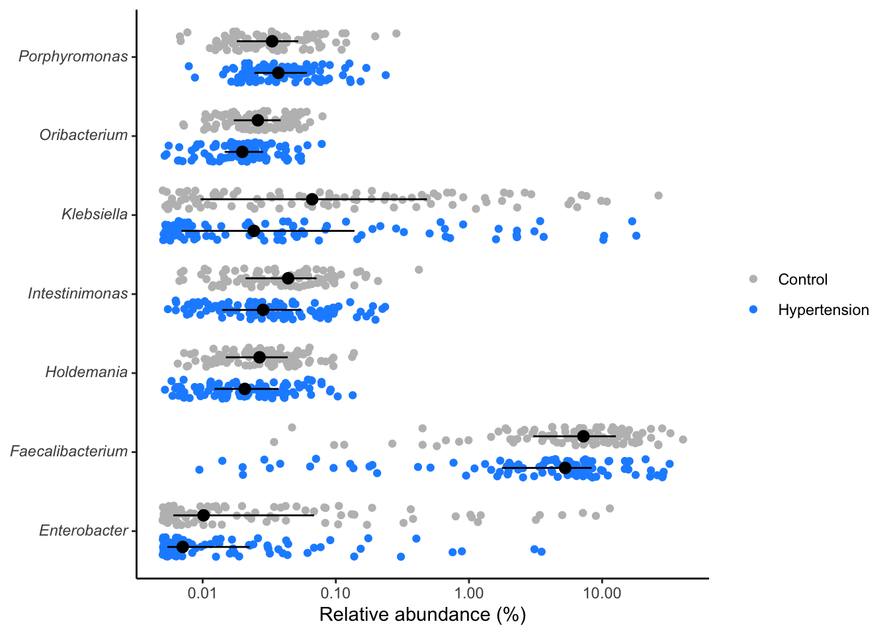
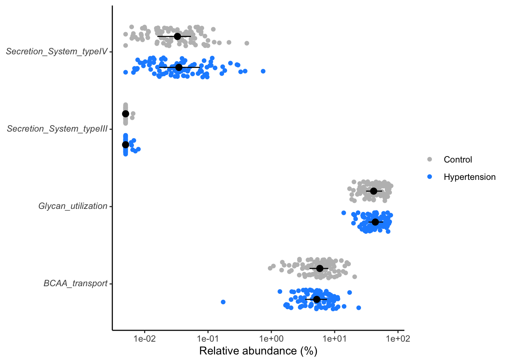
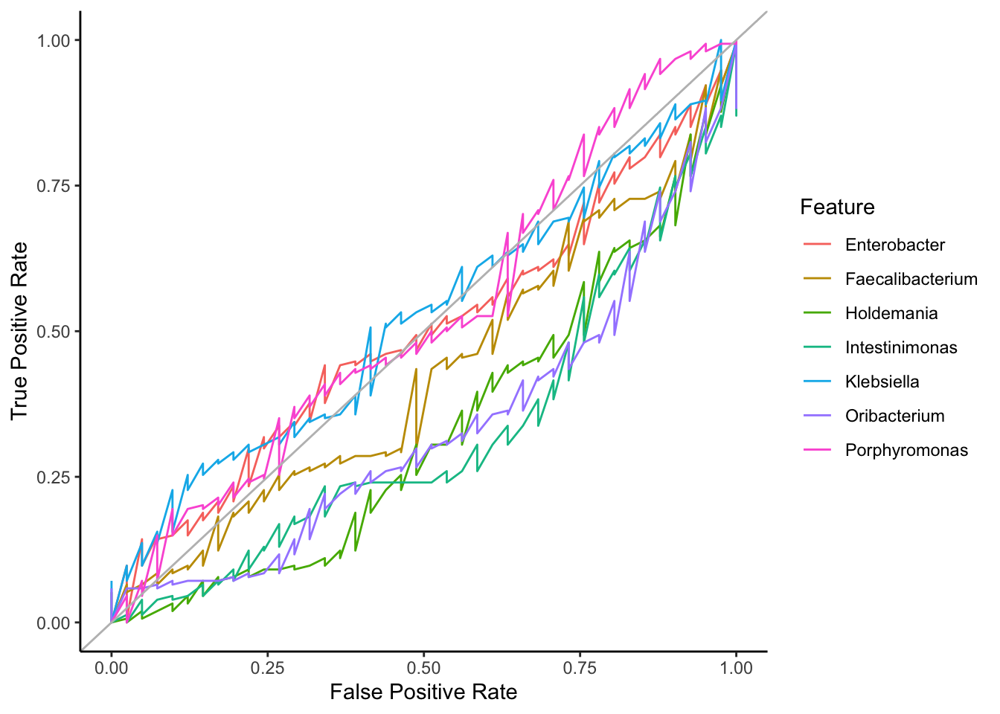
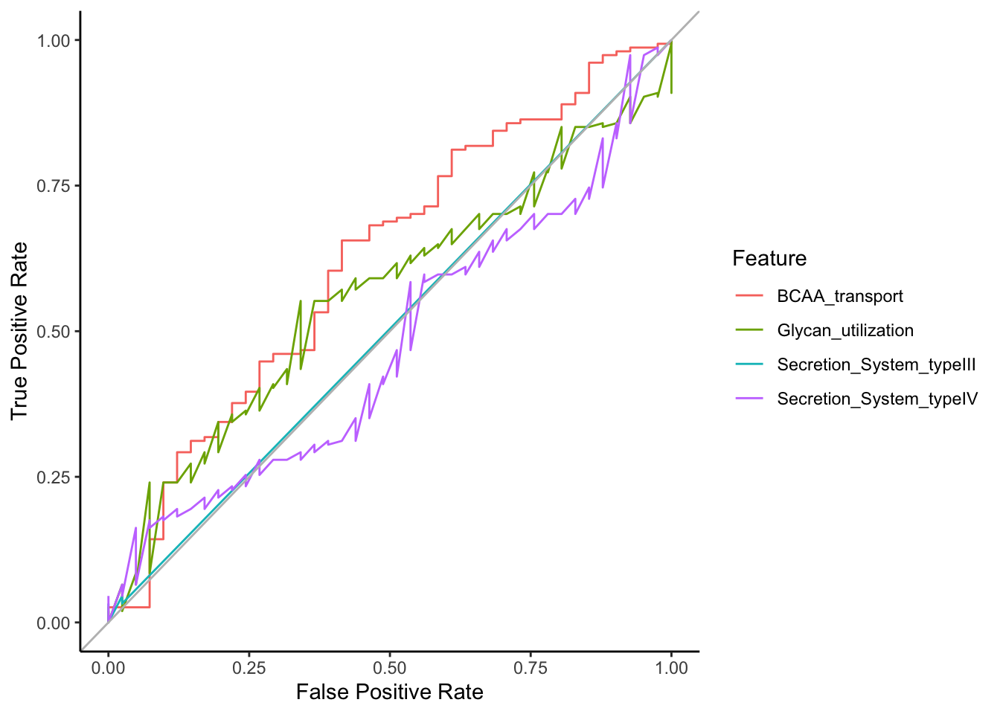

# (PART) ML FRAMEWORKS  {-}

# Machine Learning Framework in R {#ml-framework_R}


## Data Aquisition
-   NCBI project: [PRJEB13870](https://www.ncbi.nlm.nih.gov/bioproject/PRJEB13870).
-   Title: Gut microbiota dysbiosis contributes to the development of hypertension [@Zhao2017].

## Study description
-   Metagenomic and Metabonomics
-   Feacal microbiota transplantation
-   Found that dysbiosis of gut microbiome triggers the pathogenesis of hypertension through altering the metabolic effects.

## Data cleaning and tidying
1. Feature or OTU table
2. Taxonomy table
3. Metadata
4. Metabolic pathways
5. Other experimental data...


```r
library(tidyverse, suppressPackageStartupMessages())
library(broom)
library(ggtext)
library(data.table)
# library(conflicted)
# conflict_prefer("transpose", "data.table", "purr")

set.seed(2022)

otutable <- read_csv("data/HypertensionProject.csv", show_col_types = F) %>%
  dplyr::select(1, Prevotella:ncol(.)) %>%
  data.table::transpose(keep.names = "taxonomy", make.names = "SampleID") %>%
  # dplyr::select(taxonomy, starts_with("ERR")) %>%
  pivot_longer(-taxonomy, names_to="sample_id", values_to="rel_abund") %>%
  relocate(sample_id)

metabolites <- read_csv("data/HypertensionProjectMetabolites.csv", show_col_types = F) %>%
  dplyr::select(c(1,5:18 )) %>%
  data.table::transpose(keep.names = "metabopwy", make.names = "SampleID") %>%
  # dplyr::select(metabopwy, starts_with("ERR")) %>%
  pivot_longer(-metabopwy, names_to="sample_id", values_to="value") %>%
  group_by(sample_id) %>% 
  mutate(rel_abund = value/sum(value)) %>% 
  ungroup() %>% 
  dplyr::select(-value) %>% 
  relocate(sample_id)

taxonomy <- read_tsv("data/mo_demodata/baxter.cons.taxonomy", show_col_types = F) %>%
  rename_all(tolower) %>%
  dplyr::select(otu, taxonomy) %>%
  mutate(taxonomy = str_replace_all(taxonomy, "\\(\\d+\\)", ""),
         taxonomy = str_replace(taxonomy, ";unclassified", "_unclassified"),
         taxonomy = str_replace_all(taxonomy, ";unclassified", ""),
         taxonomy = str_replace_all(taxonomy, ";$", ""),
         taxonomy = str_replace_all(taxonomy, ".*;", "")
  )

metadata <- read_csv("data/HypertensionProject.csv", show_col_types = F) %>%
  dplyr::select(c(1:3)) %>%
  mutate(hyper = Disease_State == "HTN" | Disease_State == "pHTN",
         control = Disease_State == "healthy") %>%
  rename(sample_id = SampleID)

## Data joining

composite <- inner_join(metadata, otutable, by="sample_id")
metabo_composite <- inner_join(metadata, metabolites, by="sample_id")

save(otutable, metabolites, taxonomy, metadata, composite, metabo_composite, file = "data/composite_object.rda")
```

## Data Exploration for ML

> We are working with processed genera


```r
library(tidyverse, suppressPackageStartupMessages())
library(broom)
library(ggtext)
library(data.table)

set.seed(2022)

shared <- read_csv("data/HypertensionProject.csv", show_col_types = F) %>%
  dplyr::select(1, Prevotella:ncol(.)) %>%
  transpose(keep.names = "taxonomy", make.names = "SampleID") %>%
  # select(taxonomy, starts_with("ERR")) %>%
  pivot_longer(-taxonomy, names_to="sample_id", values_to="rel_abund") %>%
  relocate(sample_id)

metabolites <- read_csv("data/HypertensionProject.csv", show_col_types = F) %>%
  dplyr::select(c(1,5:18 )) %>%
  transpose(keep.names = "metabopwy", make.names = "SampleID") %>%
  # select(metabopwy, starts_with("ERR")) %>%
  pivot_longer(-metabopwy, names_to="sample_id", values_to="value") %>%
  relocate(sample_id)

taxonomy <- read_tsv("data/mo_demodata/baxter.cons.taxonomy", show_col_types = F) %>%
  rename_all(tolower) %>%
  select(otu, taxonomy) %>%
  mutate(otu = tolower(otu),
         taxonomy = str_replace_all(taxonomy, "\\(\\d+\\)", ""),
         taxonomy = str_replace(taxonomy, ";unclassified", "_unclassified"),
         taxonomy = str_replace_all(taxonomy, ";unclassified", ""),
         taxonomy = str_replace_all(taxonomy, ";$", ""),
         taxonomy = str_replace_all(taxonomy, ".*;", "")
  )

metadata <- read_csv("data/HypertensionProject.csv", show_col_types = F) %>%
  dplyr::select(c(1:3)) %>%
  mutate(prehyper = Disease_State == "pHTN",
         hyper = Disease_State == "HTN",
         control = Disease_State == "Control") %>%
  rename(sample_id = SampleID)

## Data joining

composite <- inner_join(shared, metadata, by="sample_id")
metabo_composite <- inner_join(shared, metabolites, by="sample_id") %>%
  group_by(sample_id, metabopwy) %>%
  summarize(value = sum(value), .groups="drop") %>%
  group_by(sample_id) %>%
  mutate(rel_abund = value / sum(value)) %>%
  ungroup() %>%
  select(-value) %>%
  inner_join(., metadata, by="sample_id")


ml_genus_dsestate <- composite %>%
  select(sample_id, taxonomy, enttype = Enterotype, rel_abund, dsestate = Disease_State) %>%
  pivot_wider(names_from=taxonomy, values_from = rel_abund) %>%
  select(-sample_id) %>%
  mutate(enttype = if_else(enttype == "Enterotype_1", "0", "1")) %>%
  mutate(dsestate = if_else(dsestate == "pHTN" | dsestate == "HTN" , "0", "1")) %>%
  select(-enttype) %>%
  select(dsestate, everything())

ml_genus_enttype <- composite %>%
  select(sample_id, taxonomy, enttype = Enterotype, rel_abund, dsestate = Disease_State) %>%
  pivot_wider(names_from=taxonomy, values_from = rel_abund) %>%
  select(-sample_id) %>%
  mutate(enttype = if_else(enttype == "Enterotype_1", "0", "1")) %>%
  mutate(dsestate = if_else(dsestate == "pHTN" | dsestate == "HTN" , "0", "1")) %>%
  select(-dsestate) %>%
  select(enttype, everything())

ml_pwy_dsestate <- metabo_composite %>%
  select(sample_id, metabopwy, enttype = Enterotype, rel_abund, dsestate = Disease_State) %>%
  pivot_wider(names_from=metabopwy, values_from = rel_abund) %>%
  select(-sample_id) %>%
  mutate(enttype = if_else(enttype == "Enterotype_1", "0", "1")) %>%
  mutate(dsestate = if_else(dsestate == "pHTN" | dsestate == "HTN" , "0", "1")) %>%
  select(-enttype) %>%
  select(dsestate, everything())

ml_pwy_enttype <- metabo_composite %>%
  select(sample_id, metabopwy, enttype = Enterotype, rel_abund, dsestate = Disease_State) %>%
  pivot_wider(names_from=metabopwy, values_from = rel_abund) %>%
  select(-sample_id) %>%
  mutate(enttype = if_else(enttype == "Enterotype_1", "0", "1")) %>%
  mutate(dsestate = if_else(dsestate == "pHTN" | dsestate == "HTN" , "0", "1")) %>%
  select(-dsestate) %>%
  select(enttype, everything())

save(shared,
     metabolites,
     taxonomy,
     metadata,
     composite,
     metabo_composite,
     ml_genus_dsestate,
     ml_genus_enttype,
     ml_pwy_dsestate,
     ml_pwy_enttype,
     file = "data/composite_objects4ML.rda")
```

# (PART) PERFORMANCE METRICS {-}

# Specificity and Sensitivity


```r
library(purrr)

get_sens_spec <- function(threshold, score, actual, direction){
  
  # threshold <- 100
  # score <- test$score
  # actual <- test$srn
  # direction <- "greaterthan"
  
  predicted <- if(direction == "greaterthan") {
    score > threshold 
    } else {
      score < threshold
    }
  
  tp <- sum(predicted & actual)
  tn <- sum(!predicted & !actual)
  fp <- sum(predicted & !actual)
  fn <- sum(!predicted & actual)  
  
  specificity <- tn / (tn + fp)
  sensitivity <- tp / (tp + fn)
  
  tibble("specificity" = specificity, "sensitivity" = sensitivity)
}

get_roc_data <- function(x, direction){
  
  # x <- test
  # direction <- "greaterthan"
  
  thresholds <- unique(x$score) %>% sort()
  
  map_dfr(.x=thresholds, ~get_sens_spec(.x, x$score, x$srn, direction)) %>%
    rbind(c(specificity = 0, sensitivity = 1))
  
}
```


## Significant genera with `wilcox.test`


```r
library(purrr)
library(dplyr)
library(tidyr)

all_genera <- composite %>%
  tidyr::nest(data = -taxonomy) %>%
  mutate(test = purrr::map(.x=data, ~wilcox.test(rel_abund~hyper, data=.x) %>% tidy)) %>%
  tidyr::unnest(test) %>%
  mutate(p.adjust = p.adjust(p.value, method="BH"))

sig_genera <- all_genera %>% 
  dplyr::filter(p.value < 0.05) %>%
  arrange(p.adjust) %>% 
  dplyr::select(taxonomy, p.value)
```

## View distribution of significant genera

```r
composite %>%
  inner_join(sig_genera, by="taxonomy") %>%
  mutate(rel_abund = 100 * (rel_abund + 1/20000),
         taxonomy = str_replace(taxonomy, "(.*)", "*\\1*"),
         taxonomy = str_replace(taxonomy, "\\*(.*)_unclassified\\*",
                                "Unclassified<br>*\\1*"),
         hyper = factor(hyper, levels = c(T, F))) %>%
  ggplot(aes(x=rel_abund, y=taxonomy, color=hyper, fill=hyper)) +
  # geom_vline(xintercept = 100/10530, size=0.5, color="gray") +
  geom_jitter(position = position_jitterdodge(dodge.width = 0.8,
                                              jitter.width = 0.5),
              shape=21) +
  stat_summary(fun.data = median_hilow, fun.args = list(conf.int=0.5),
               geom="pointrange",
               position = position_dodge(width=0.8),
               color="black", show.legend = FALSE) +
  scale_x_log10() +
  scale_color_manual(NULL,
                     breaks = c(F, T),
                     values = c("gray", "dodgerblue"),
                     labels = c("Control", "Hypertension")) +
  scale_fill_manual(NULL,
                     breaks = c(F, T),
                     values = c("gray", "dodgerblue"),
                     labels = c("Control", "Hypertension")) +
  labs(x= "Relative abundance (%)", y=NULL) +
  theme_classic() +
  theme(
    axis.text.y = element_markdown()
  )
```



```r
ggsave("figures/significant_genera.tiff", width=6, height=4)
```

## Significant pathways
Compute the significant pathways using `wilcox.test`.


```r
library(tidyverse)

all_metabopwy <- metabo_composite %>%
  tidyr::nest(data = -metabopwy) %>%
  mutate(test = purrr::map(.x=data, ~wilcox.test(rel_abund~hyper, data=.x) %>% tidy)) %>%
  tidyr::unnest(test) %>%
  mutate(p.adjust = p.adjust(p.value, method="BH"))

sig_metabopwy <- all_metabopwy %>% 
  dplyr::filter(p.value < 0.3) %>% # Typically, the best significant p-value is set at 0.05
  dplyr::select(metabopwy, p.value)
```

## View distribution of significant metabolic pathways
- Compute the significant pathways, then
- P-values or Adjusted P-values (p.adjust) can be used to measure the significance levels.
- View the distribution of the significant pathways.


```r
metabo_composite %>%
  inner_join(sig_metabopwy, by="metabopwy") %>%
  mutate(rel_abund = 100 * (rel_abund + 1/20000),
         metabopwy = str_replace(metabopwy, "(.*)", "*\\1*"),
         metabopwy = str_replace(metabopwy, "\\*(.*)_unclassified\\*",
                                "Unclassified<br>*\\1*"),
         hyper = factor(hyper, levels = c(T, F))) %>%
  ggplot(aes(x=rel_abund, y=metabopwy, color=hyper, fill=hyper)) +
  geom_jitter(position = position_jitterdodge(dodge.width = 0.8,
                                              jitter.width = 0.5),
              shape=21) +
  stat_summary(fun.data = median_hilow, fun.args = list(conf.int=0.5),
               geom="pointrange",
               position = position_dodge(width=0.8),
               color="black", show.legend = FALSE) +
  scale_x_log10() +
  scale_color_manual(NULL,
                     breaks = c(F, T),
                     values = c("gray", "dodgerblue"),
                     labels = c("Control", "Hypertension")) +
  scale_fill_manual(NULL,
                     breaks = c(F, T),
                     values = c("gray", "dodgerblue"),
                     labels = c("Control", "Hypertension")) +
  labs(x= "Relative abundance (%)", y=NULL) +
  theme_classic() +
  theme(
    axis.text.y = element_markdown()
  )
```



```r
ggsave("figures/significant_genera.tiff", width=6, height=4)
```

> Here we filter the metabolic pathways at a lesser stringent `p.values` (p < 0.25) for demo purposes.


## ROC curve: Receiver Operating Characteristic curve
- Shows the performance of a classification model at all classification thresholds. 
- Plots **True Positive Rate (TPR = Sensitivity)** and **False Positive Rate (FPR = 1 - Specificity)** at all classification thresholds.

## AUC: Area Under the ROC Curve
- It measures the entire two-dimensional area underneath the entire ROC curve.
- In calculus it can be represented as (0,0) to (1,1).
- AUC provides an aggregate measure of performance across all possible classification thresholds. 

AUC is desirable for the following two reasons:

- AUC is **scale-invariant**. It measures how well predictions are ranked, rather than their absolute values.
- AUC is **classification-threshold-invariant**. It measures the quality of the model's predictions irrespective of what classification threshold is chosen

![]

## Load functions and data objects
Functions for computing:
 
- Sensitivity
- Specificity
- ROC

Data objects for the ROC curve
- composite
- metabo_composite


```r
get_sens_spec <- function(threshold, score, actual, direction){

  predicted <- if(direction == "greaterthan") {
    score > threshold
  } else {
    score < threshold
  }

  tp <- sum(predicted & actual)
  tn <- sum(!predicted & !actual)
  fp <- sum(predicted & !actual)
  fn <- sum(!predicted & actual)

  specificity <- tn / (tn + fp)
  sensitivity <- tp / (tp + fn)

  tibble("specificity" = specificity, "sensitivity" = sensitivity)
}

get_roc_data <- function(x, direction){
  thresholds <- unique(x$score) %>% sort()

  map_dfr(.x=thresholds, ~get_sens_spec(.x, x$score, x$hyper, direction)) %>%
    rbind(c(specificity = 0, sensitivity = 1))

}
load("data/composite_object.rda", verbose = T)
```

```
Loading objects:
  otutable
  metabolites
  taxonomy
  metadata
  composite
  metabo_composite
```

## Prepare ROC data

<!-- - Use map2(.x, .y, .f, ...) from purrr package -->


```r
library(purrr)
library(dplyr)
library(tidyr) # for nest() & unnest()

roc_data <- composite %>%
  rename_all(tolower) %>% 
  inner_join(sig_genera, by="taxonomy") %>%
  dplyr::select(sample_id, taxonomy, rel_abund, hyper) %>%
  pivot_wider(names_from=taxonomy, values_from=rel_abund) %>%
  pivot_longer(cols=-c(sample_id, hyper), names_to="feature", values_to="score") %>%
  nest(data = -feature) %>%
  mutate(direction = if_else(feature == "Ruminiclostridium", "lessthan","greaterthan")) %>%
  mutate(roc_data = map2(.x = data, .y=direction, ~ get_roc_data(.x, .y))) %>%
  unnest(roc_data) %>%
  dplyr::select(feature, specificity, sensitivity)

## Plot ROC data
roc_data %>%
  ggplot(aes(x=1-specificity, y=sensitivity, color = feature)) +
  geom_line() +
  geom_abline(slope = 1, intercept = 0, color="gray") +
  theme_classic() + 
  labs(x = "False Positive Rate", y = "True Positive Rate", color = "Feature")
```



```r
ggsave("figures/roc_figure.tiff", width=6, height=4)
```

> Note: We have separate lines for each biomarker for the feature shown on the legend!

## Metabolic pathway data

```r
library(dplyr)
library(tidyr) # for nest() & unnest()

metabo_roc_data <- metabo_composite %>%
  rename_all(tolower) %>% 
  inner_join(sig_metabopwy, by="metabopwy") %>%
  dplyr::select(sample_id, metabopwy, rel_abund, hyper) %>%
  pivot_wider(names_from=metabopwy, values_from=rel_abund) %>%
  pivot_longer(cols=-c(sample_id, hyper), names_to="feature", values_to="score") %>%
  nest(data = -feature) %>%
  mutate(direction = if_else(feature == "BCAA_transport", "lessthan","greaterthan")) %>%
  mutate(roc_data = map2(.x = data, .y=direction, ~ get_roc_data(.x, .y))) %>%
  unnest(roc_data) %>%
  dplyr::select(feature, specificity, sensitivity)


metabo_roc_data %>%
  ggplot(aes(x=1-specificity, y=sensitivity, color = feature)) +
  geom_line() +
  geom_abline(slope = 1, intercept = 0, color="gray") +
  theme_classic() + 
  labs(x = "False Positive Rate", y = "True Positive Rate", color = "Feature")
```



```r
ggsave("figures/roc_figure.tiff", width=6, height=4)
```

> Note: We have separate lines for each biomarker for the feature shown on the legend!
> More data can be added to get a better improved classification.


# (PART) USE CASES IDEAS {-}

# Example Use Cases for Knowledge

## Case Study1: [Cancer Prediction](https://developers.google.com/machine-learning/crash-course/cancer-prediction)
- Model was trained to predict "probability patient has cancer" from medical records.
- Features included patient age, gender, prior medical conditions, hospital name, vital signs, test results.
- Model gave excellent performance on held-out test data.

> But model performed terribly on new patients -- why?

1. **Label leakage**: Hospital name was included as one of the features! The hospital was a very good predictor for patients with cancer. It specializes in cancer treatment. Showing the model the name of the hospital is a subtle form of cheating...exposing a doctor diagnosis to the model

## Case Study2: [Literature](https://developers.google.com/machine-learning/crash-course/18th-century-literature)
- Professor of 18th Century Literature wanted to predict the political affiliation of authors based only on the "mind metaphors" the author used.
- Team of researchers made a big labeled data set with many authors' works, sentence by sentence, and split into train/validation/test sets.
- Trained model did nearly perfectly on test data

> But researchers felt results were suspiciously accurate. What might have gone wrong?

- Data Split A: Researchers put some of each author's examples in training set, some in validation set, some in test set.
- Data Split B: Researchers put all of each author's examples in a single set.
- Results: The model trained on Data Split A had much higher accuracy than the model trained on Data Split B.

> The moral: carefully consider how you split examples. Must know what the data represents.

{width=100%}

## Some Effective [ML Guidelines](https://developers.google.com/machine-learning/crash-course/real-world-guidelines)
- Keep the first model simple.
- Focus on ensuring data pipeline correctness.
- Use a simple, observable metric for training & evaluation.
- Own and monitor your input features
- Treat your model configuration as code: review it, check it in
- Write down the results of all experiments, especially "failures"

```

