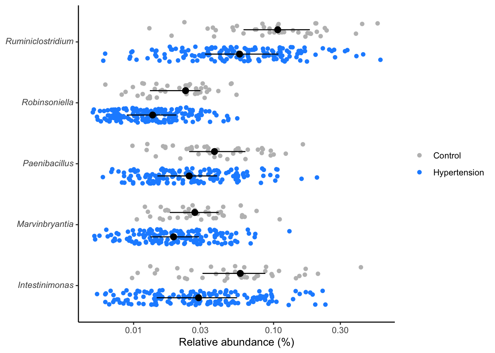
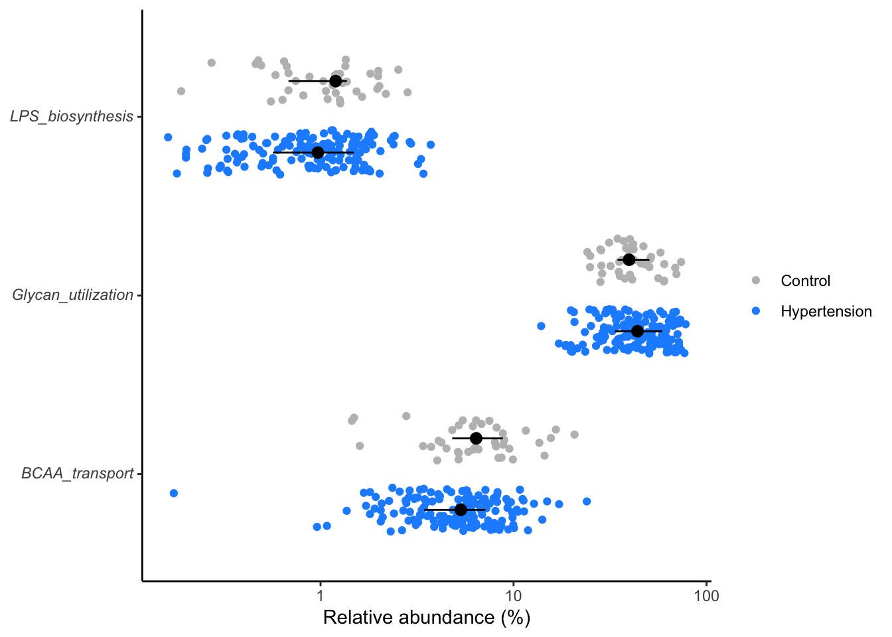
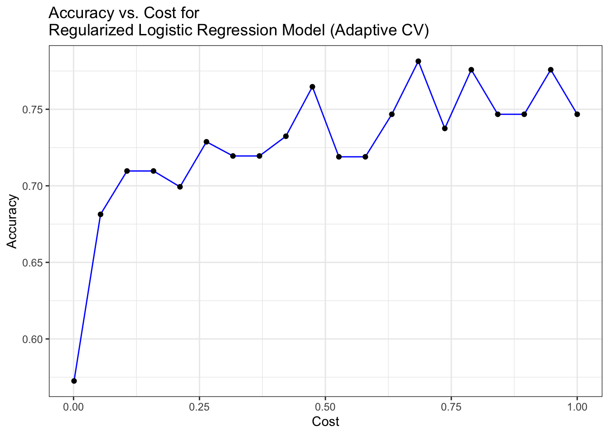

# (PART) ML PROTOTYPES {-}

# Machine Learning Prototypes: Streamlining Microbiome Model Development and Deployment

Machine Learning Prototypes (MLPs) serve as foundational frameworks for accelerating and enhancing machine learning endeavors within the context of microbiome research. These robust solutions offer streamlined approaches for developing, deploying, and monitoring machine learning models tailored specifically for microbiome data analysis.


## Key Features of ML Prototype

Here are the essential attributes and characteristics of MLPs:

- **Robust and Open-Source:** MLPs are robust, open-source solutions designed to accelerate the development and deployment of machine learning models.

- **Comprehensive Frameworks:** Fully developed MLPs empower Data Scientists by providing comprehensive frameworks to seamlessly build, deploy, and monitor ML models.

- **Tailored to Common Use Cases:** MLPs are meticulously crafted around common industry use cases, such as Churn Prediction Monitoring and Anomaly Detection, ensuring relevance and applicability across diverse domains.

- **Built According to Best Practices:** MLPs are developed according to best practices, undergoing rigorous review and testing to guarantee reliability and performance.

- **Reproducibility:** MLPs are designed to be reproducible, offering the flexibility to retrain models or develop customized applications tailored to specific needs.

- **Advantageous Head Start:** MLPs offer a significant advantage by providing a head start in the machine learning development process.


# (PART) MODEL DEVELOPMENT {-}

# Exploratory Data Analysis (EDA)
In machine learning we start by exploring the data to understand the structure, patterns, and relationships within the data. This involves visualizing distributions, correlations, and other relevant statistics to gain insights into the dataset.

## Preprocessing Metagenomics data
Source: [PRJEB13870](https://www.ncbi.nlm.nih.gov/bioproject/PRJEB13870). The project titled "Gut microbiota dysbiosis contributes to the development of hypertension" serves as an ideal resource for metagenomics dataset. This dataset offers valuable insights into the association between gut microbiota composition and hypertension development, a critical area of research within the fields of microbiology and cardiovascular health.

### Load necessary libraries

```r
# Load necessary libraries with suppressed startup messages
library(tidyverse, suppressPackageStartupMessages())
library(broom)
library(ggtext)
library(data.table)

# Set seed for reproducibility
set.seed(2022)
```


### Processing OTU table data

```r
otutable <- readr::read_csv("data/HypertensionProject.csv", show_col_types = FALSE) %>%
  dplyr::select(1, Prevotella:ncol(.)) %>%
  data.table::transpose(keep.names = "taxonomy", make.names = "SampleID") %>%
  tidyr::pivot_longer(-taxonomy, names_to="sample_id", values_to="rel_abund") %>%
  dplyr::relocate(sample_id)
```


### Processing metabolites data

```r
metabolites <- read_csv("data/HypertensionProjectMetabolites.csv", show_col_types = FALSE) %>%
  dplyr::select(c(1, 5:ncol(.))) %>%
  data.table::transpose(keep.names = "metabopwy", make.names = "SampleID") %>%
  tidyr::pivot_longer(-metabopwy, names_to="sample_id", values_to="value") %>%
  dplyr::group_by(sample_id) %>% 
  dplyr::mutate(rel_abund = value/sum(value)) %>% 
  dplyr::ungroup() %>% 
  dplyr::select(-value) %>% 
  dplyr::relocate(sample_id)
```


### Processing taxonomy data

```r
taxonomy <- readr::read_tsv("data/mo_demodata/baxter.cons.taxonomy", show_col_types = FALSE) %>%
  dplyr::rename_all(tolower) %>%
  dplyr::select(otu, taxonomy) %>%
  dplyr::mutate(taxonomy = stringr::str_replace_all(taxonomy, "\\(\\d+\\)", ""),
         taxonomy = stringr::str_replace(taxonomy, ";unclassified", "_unclassified"),
         taxonomy = stringr::str_replace_all(taxonomy, ";unclassified", ""),
         taxonomy = stringr::str_replace_all(taxonomy, ";$", ""),
         taxonomy = stringr::str_replace_all(taxonomy, ".*;", ""))
```


### Processing metadata

```r
metadata <- readr::read_csv("data/HypertensionProject.csv", show_col_types = FALSE) %>%
  dplyr::select(c(1:3)) %>%
  dplyr::mutate(hyper = Disease_State == "HTN" | Disease_State == "pHTN",
         control = Disease_State == "healthy") %>%
  dplyr::rename(sample_id = SampleID)
```


## Joining metagenomics data

### Join metadata with OTU table


```r
# Join metadata with OTU table to create composite dataset
composite <- dplyr::inner_join(metadata, otutable, by="sample_id")
head(composite)
# A tibble: 6 × 7
  sample_id  Disease_State Enterotype   hyper control taxonomy         rel_abund
  <chr>      <chr>         <chr>        <lgl> <lgl>   <chr>                <dbl>
1 ERR1398068 HTN           Enterotype_1 TRUE  FALSE   Prevotella         5.53e-1
2 ERR1398068 HTN           Enterotype_1 TRUE  FALSE   Faecalibacterium   1.70e-2
3 ERR1398068 HTN           Enterotype_1 TRUE  FALSE   Klebsiella         2.99e-6
4 ERR1398068 HTN           Enterotype_1 TRUE  FALSE   Roseburia          7.47e-3
5 ERR1398068 HTN           Enterotype_1 TRUE  FALSE   Bifidobacterium    1.92e-3
6 ERR1398068 HTN           Enterotype_1 TRUE  FALSE   Enterobacter       8.52e-7
```

### Join metadata with metabolites data


```r
# Join metadata with metabolites data to create composite metabolites dataset
metabo_composite <- dplyr::inner_join(metadata, metabolites, by="sample_id")
head(metabo_composite)
# A tibble: 6 × 7
  sample_id  Disease_State Enterotype   hyper control metabopwy        rel_abund
  <chr>      <chr>         <chr>        <lgl> <lgl>   <chr>                <dbl>
1 ERR1398068 HTN           Enterotype_1 TRUE  FALSE   LPS_biosynthesis 0.00962  
2 ERR1398068 HTN           Enterotype_1 TRUE  FALSE   LPS_transport    0.0000221
3 ERR1398068 HTN           Enterotype_1 TRUE  FALSE   PTS              0.203    
4 ERR1398068 HTN           Enterotype_1 TRUE  FALSE   Secretion_Syste… 0.0000221
5 ERR1398068 HTN           Enterotype_1 TRUE  FALSE   Secretion_Syste… 0        
6 ERR1398068 HTN           Enterotype_1 TRUE  FALSE   Secretion_Syste… 0.000375 
```


## Preprocessing microbiome data
For an outline of the steps involved in processing and integrating microbiome (16S rRNA) OTU table, taxonomy data, and metadata, please refer to [imap-data-preparation](https://tmbuza.github.io/imap-data-preparation). Our primary dataset is sourced from the publicly available Dietswap dataset, retrieved from the microbiome package. This dataset has been preprocessed and integrated into a long-form dataframe format already.


### Import preprocessed microbiome data
```bash
# Using dietswap dataset from microbiome package
cp ../imap-data-preparation/data/phyloseq_raw_rel_psextra_df_objects.rda data

```

### Load saved data objects

```r
load("data/phyloseq_raw_rel_psextra_df_objects.rda", verbose = TRUE)
Loading objects:
  ps_raw
  ps_rel
  psextra_raw
  psextra_rel
  ps_df
```


### View phyloseq object

```r
ps_raw
phyloseq-class experiment-level object
otu_table()   OTU Table:         [ 130 taxa and 222 samples ]
sample_data() Sample Data:       [ 222 samples by 8 sample variables ]
tax_table()   Taxonomy Table:    [ 130 taxa by 3 taxonomic ranks ]
phy_tree()    Phylogenetic Tree: [ 130 tips and 129 internal nodes ]
```


### View dataframe structure

```r
head(ps_df[, c(1, 4, 9, 11, 12, 13)])
# A tibble: 6 × 6
  sample_id  nationality bmi        rel_abund level  taxon                      
  <chr>      <fct>       <fct>          <dbl> <chr>  <chr>                      
1 Sample-208 AFR         overweight     0.617 phylum *Bacteroidetes*            
2 Sample-208 AFR         overweight     0.617 family *Bacteroidetes*            
3 Sample-208 AFR         overweight     0.617 genus  *Prevotella melaninogenica*
4 Sample-208 AFR         overweight     0.617 otu    *Prevotella melaninogenica*
5 Sample-212 AFR         obese          0.702 phylum *Bacteroidetes*            
6 Sample-212 AFR         obese          0.702 family *Bacteroidetes*            
```


## Processing data for machine learning

This section outlines the preprocessing steps involved in preparing data subsets tailored for machine learning analysis. The code segments transform raw data into structured formats suitable for predictive modeling. Specifically, the subsets created encompass various combinations of taxonomic or metabolic features alongside binary labels representing selected features. Each subset undergoes specific preprocessing steps, including data selection, transformation, and encoding, to ensure compatibility with machine learning algorithms.

### Data for disease state prediction 
This code snippet prepares a dataset for machine learning tasks. It selects specific columns from a composite dataset, renames some columns for clarity, pivots the data into a wider format, and finally, transforms some categorical variables into binary ones for modeling purposes. Here's a brief description:

```r
library(dplyr)
library(tidyr)

# Prepare dataset for machine learning
ml_genus_dsestate <- composite %>%
  # Select relevant columns and rename them
  select(sample_id, taxonomy, rel_abund, dsestate = Disease_State) %>%
  # Pivot data to wider format
  pivot_wider(names_from=taxonomy, values_from = rel_abund) %>%
  # Remove sample_id
  select(-sample_id) %>%
  # Convert categorical variables to binary
  mutate(dsestate = if_else(dsestate == "pHTN" | dsestate == "HTN" , "0", "1")) %>%
  # Reorder columns with dsestate first
  select(dsestate, everything())

head(ml_genus_dsestate[1:3, 1:5])
# A tibble: 3 × 5
  dsestate Prevotella Faecalibacterium Klebsiella Roseburia
  <chr>         <dbl>            <dbl>      <dbl>     <dbl>
1 0             0.553          0.0170  0.00000299   0.00747
2 0             0.217          0.285   0.0000593    0.00236
3 0             0.298          0.00443 0.00513      0.00751
```


### Data for enterotype prediction

```r

# Subset for machine learning analysis: Taxonomic genus features with enterotypes
ml_genus_enttype <- composite %>%
  select(sample_id, taxonomy, enttype = Enterotype, rel_abund, dsestate = Disease_State) %>%
  pivot_wider(names_from=taxonomy, values_from = rel_abund) %>%
  select(-sample_id) %>%
  mutate(enttype = if_else(enttype == "Enterotype_1", "0", "1")) %>%
  mutate(dsestate = if_else(dsestate == "pHTN" | dsestate == "HTN" , "0", "1")) %>%
  select(-dsestate) %>%
  select(enttype, everything())

head(ml_genus_enttype[1:3, 1:5])
# A tibble: 3 × 5
  enttype Prevotella Faecalibacterium Klebsiella Roseburia
  <chr>        <dbl>            <dbl>      <dbl>     <dbl>
1 0            0.553          0.0170  0.00000299   0.00747
2 0            0.217          0.285   0.0000593    0.00236
3 0            0.298          0.00443 0.00513      0.00751
```

### Data for nationality prediction

```r
# Dietswap dataset: Subset for machine learning analysis: Taxonomic genus features with nationality and body mass index group

# Nationality feature
ml_genus_nationality <- ps_df %>%
  select(sample_id, taxon, nationality, rel_abund) %>%
  mutate(
    taxon = str_replace_all(taxon, "\\*", ""),
    nationality = factor(if_else(nationality == "AAM", "0", "1"), levels = c("0", "1")),) %>%
  group_by(sample_id, taxon, nationality) %>%
  summarise(rel_abund = mean(rel_abund), .groups = "drop") %>%
  pivot_wider(names_from = taxon, values_from = rel_abund) %>%
  ungroup() %>%
  filter(!is.na(nationality)) %>%  # Remove rows with NA in the 'nationality' column
  select(-c(sample_id)) %>%
  mutate(across(starts_with("rel_abund"), as.numeric))

head(ml_genus_nationality[1:3, 1:5])
# A tibble: 3 × 5
  nationality Actinobacteria Akkermansia `Alcaligenes faecalis` Allistipes
  <fct>                <dbl>       <dbl>                  <dbl>      <dbl>
1 0                 0.00121      0.00213               0.000118    0.0397 
2 1                 0.000533     0.00724               0.000406    0.00180
3 1                 0.00123      0.136                 0.000420    0.00897
```


### Data for body mass index prediction

>Dataset: Dietswap from microbiome R package


```r
ml_genus_bmi <- ps_df %>%
  select(sample_id, taxon, rel_abund, bmi) %>%
  mutate(
    taxon = str_replace_all(taxon, "\\*", ""),
    bmi = factor(if_else(bmi == "overweight" | bmi == "obese", "0", "1"), levels = c("0", "1"))
  ) %>%
  group_by(sample_id, taxon, bmi) %>%
  summarise(rel_abund = mean(rel_abund), .groups = "drop") %>%
  pivot_wider(names_from = taxon, values_from = rel_abund) %>%
  ungroup() %>%
  filter(!is.na(bmi)) %>%  # Remove rows with NA in the 'bmi' column
  select(-c(sample_id)) %>%
  mutate(across(starts_with("rel_abund"), as.numeric))

head(ml_genus_bmi[1:3, 1:5])
# A tibble: 3 × 5
  bmi   Actinobacteria Akkermansia `Alcaligenes faecalis` Allistipes
  <fct>          <dbl>       <dbl>                  <dbl>      <dbl>
1 0           0.00121      0.00213               0.000118    0.0397 
2 1           0.000533     0.00724               0.000406    0.00180
3 1           0.00123      0.136                 0.000420    0.00897
```


### Save the processed data into RDA objects

```r
save(composite,
     metabo_composite,
     ml_genus_dsestate,
     ps_df,
     ml_genus_enttype, 
     ml_genus_nationality, 
     ml_genus_bmi, 
     file = "data/ml_n_composite_object.rda")
```


<div class="alerticon">
<p><strong>Note for users:</strong></p>
<blockquote>
<p>If you encounter issues during data processing where pivot_wider()
returns values as &lt;list&gt;, it may be due to multiple values for the
same combination of identifiers (e.g., sample ID and feature). In such
cases, consider aggregating the values using group_by() and summarise()
before pivoting.</p>
</blockquote>
<p>Example:</p>
<p>ps_df %&gt;% select(sample_id, taxon, nationality, rel_abund, bmi)
%&gt;% mutate(taxon = str_replace_all(taxon, “\*“,”“)) %&gt;%
group_by(sample_id, taxon, nationality, bmi) %&gt;% summarise(rel_abund
= mean(rel_abund), .groups =”drop”) %&gt;% pivot_wider(names_from =
taxon, values_from = rel_abund) %&gt;% mutate(nationality =
if_else(nationality == “AAM”, “0”, “1”)) %&gt;% mutate(bmi = if_else(bmi
== “overweight” | bmi == “obese” , “0”, “1”)) %&gt;%
select(-c(sample_id, bmi))</p>
<blockquote>
<p>This ensures that the rel_abund values are properly aggregated before
pivoting.</p>
</blockquote>
</div>


# (PART) FEATURE ENGINEERING {-}

# Feature Engineering

Feature engineering is a crucial step in the machine learning pipeline where raw data is transformed into a format that enhances the performance of predictive models. This process involves creating new features, selecting relevant features, and transforming existing features to improve the model's ability to capture patterns and make accurate predictions. 

> By performing effective feature engineering, we can improve the performance, interpretability, and robustness of machine learning models, ultimately leading to better predictions and insights from the data.

Some common techniques used in feature engineering include feature creation, selection and transformation.

## Feature Creation (Simplified Example)
Feature creation involves generating new features from existing ones. This can include extracting information from text, dates, or categorical variables, or creating interaction terms between variables. 


For example: In this simplified example, we demonstrate feature creation using demographic data.Here, we divide ages into three groups based on the 'age' column to create a new feature called 'age_group'. We first load the necessary libraries, then create sample data containing information about age, gender, and income. We then create a new feature called **age_group** based on the 'age' column, dividing ages into three groups: "<30", "30-40", and ">40". Finally, we display the DataFrame with the new feature included.

### Sample dataframe

```r
# Load necessary libraries
library(tidyverse)

# Sample data
data <- tibble(
  age = c(25, 30, 35, 40, 45),
  gender = c('male', 'female', 'male', 'male', 'female'),
  income = c(50000, 60000, 75000, 80000, 70000)
)

# Creating a DataFrame
df <- as_tibble(data)
print(df)
# A tibble: 5 × 3
    age gender income
  <dbl> <chr>   <dbl>
1    25 male    50000
2    30 female  60000
3    35 male    75000
4    40 male    80000
5    45 female  70000
```

### Creating a new feature 'age_group'

```r
# Feature creation example: creating a new feature 'age_group' based on age
df <- df %>%
  mutate(age_group = cut(age, breaks = c(0, 30, 40, Inf), labels = c("<30", "30-40", ">40")))

# Displaying the DataFrame with the new feature
print(df)
# A tibble: 5 × 4
    age gender income age_group
  <dbl> <chr>   <dbl> <fct>    
1    25 male    50000 <30      
2    30 female  60000 <30      
3    35 male    75000 30-40    
4    40 male    80000 30-40    
5    45 female  70000 >40      
```

> While this example demonstrates feature creation using demographic data, the same principles apply to various types of data, including metagenomics and microbiome data.


## Feature Selection
Identifying the most relevant features that contribute the most to the predictive power of the model while reducing dimensionality and computational complexity.

- **Objective**: Perform feature selection to identify relevant microbial taxa or functional pathways associated with the binary outcome of interest, such as disease status or treatment response.
- **Techniques**: Utilize methods like Lasso regularization, Recursive Feature Elimination (RFE), and Boruta algorithm to automatically select important features and penalize less informative ones, enhancing model interpretability and performance.


## Feature Selection Techniques
Feature selection techniques aim to identify the most relevant and informative features for modeling, reducing the dimensionality of the data while preserving predictive performance. Key techniques include:

- **Variance Threshold**: Eliminates features with low variance, indicating little variability and potentially less relevance to the target variable.
- **Univariate Selection**: Examines each feature's relationship with the target variable independently, selecting those with the strongest statistical significance.
- **Recursive Feature Elimination (RFE)**: Sequentially removes the least important features, based on model performance, until an optimal subset is obtained.
- **Principal Component Analysis (PCA)**: Projects the original features into a lower-dimensional space, retaining the most critical information while reducing dimensionality.
- **Feature Importance**: Determines the importance of features by assessing their contribution to model performance. Techniques include Random Forest feature importance and permutation importance.
- **Correlation Analysis**: Identifies relationships between pairs of features, helping to detect redundant or highly correlated variables.
- **Forward/Backward Selection**: Iteratively adds or removes features from the model, based on their impact on performance, to arrive at the best subset.
- **Least Absolute Shrinkage and Selection Operator (LASSO)**: Penalizes the absolute size of feature coefficients, encouraging sparse solutions and automatic feature selection.

> These techniques facilitate the creation of more efficient and interpretable models by focusing on the most informative features while reducing redundancy and noise.


### Demo using Variance threshold
- It involves calculating the variance of each feature.
- Only those features whose variance exceeds a predefined threshold are selected.
- This method is useful for filtering out features that have very low variance, indicating little variation in the data.


```r
library(tidyverse)

# Example dataset (replace with your own data)
data <- ml_genus_nationality
# data <- ml_genus_bmi
# data <- ml_genus_enttype
# data <- ml_genus_dsestate

# Calculate variance for each feature
variances <- apply(data[, -1], 2, var)  # Exclude the first column (nationality)

# Set the threshold for variance
threshold <- 0.0001  # Adjust as needed

# Identify features with variance above the threshold
selected_features <- names(variances[variances > threshold])

# Remove NA values from selected_features
selected_features <- selected_features[!is.na(selected_features)]

# Add the first column (nationality) to the selected features
selected_features <- c("nationality", selected_features)

# Filter dataset to include selected features
filtered_data <- data[, colnames(data) %in% selected_features]

# Display filtered dataset
head(filtered_data[1:3, 1:5])
# A tibble: 3 × 5
  nationality Akkermansia Allistipes `Bacteroides fragilis` `Bacteroides ovatus`
  <fct>             <dbl>      <dbl>                  <dbl>                <dbl>
1 0               0.00213    0.0397                 0.0524              0.0505  
2 1               0.00724    0.00180                0.00151             0.000637
3 1               0.136      0.00897                0.0729              0.00518 
```

### Demo using Correlation Analysis
- This method involves calculating the correlation between each feature and the target variable (or another feature).
- Features are then selected based on their correlation coefficients.
- A cutoff point for the correlation coefficient can be set to determine which features are considered relevant.
- Features with correlation coefficients above this cutoff are retained, while those below are discarded.


```r
# Example dataset (replace with your own data)
data <- ml_genus_nationality

# Calculate point-biserial correlation between each feature and the categorical target variable
correlations <- sapply(data[-1], function(x) cor(x, as.numeric(data$nationality)))

# Set the threshold for correlation
threshold <- 0.3  # Adjust as needed

# Identify features with correlation above the threshold
selected_features <- names(correlations[abs(correlations) > threshold])

# Add the target variable (nationality) to the selected features
selected_features <- c("nationality", selected_features)

# Filter dataset to include selected features
filtered_data <- data[, colnames(data) %in% selected_features]

# Display filtered dataset
head(filtered_data[1:3, 1:5])
# A tibble: 3 × 5
  nationality Allistipes `Anaerostipes caccae` `Bacteroides fragilis`
  <fct>            <dbl>                 <dbl>                  <dbl>
1 0              0.0397                0.0288                 0.0524 
2 1              0.00180               0.00168                0.00151
3 1              0.00897               0.00168                0.0729 
# ℹ 1 more variable: `Bacteroides ovatus` <dbl>
```

> Note: NA values must be removed from the selected_features vector before filtering the dataset to avoid errors.

### Demo with Wilcoxon rank sum test
The Wilcoxon rank sum test, also known as the Mann-Whitney U test, is a nonparametric test used to assess whether two independent samples have different distributions. It is particularly useful when the assumptions of the t-test are not met, such as when the data is not normally distributed or when the sample sizes are small


```r
library(purrr)
library(dplyr)
library(tidyr)

all_genera <- composite %>%
  tidyr::nest(data = -taxonomy) %>%
  mutate(test = purrr::map(.x=data, ~wilcox.test(rel_abund~hyper, data=.x) %>% tidy)) %>%
  tidyr::unnest(test) %>%
  mutate(p.adjust = p.adjust(p.value, method="BH"))

sig_genera <- all_genera %>% 
  dplyr::filter(p.value < 0.001) %>%
  arrange(p.adjust) %>% 
  dplyr::select(taxonomy, p.value)
```

**Distribution of significant genera**

- Compute the significant genera, then
- P-values or Adjusted P-values (p.adjust) can be used to measure the significance levels.
- View the distribution of the significant genera


```r
composite %>%
  inner_join(sig_genera, by="taxonomy") %>%
  mutate(rel_abund = 100 * (rel_abund + 1/20000),
         taxonomy = str_replace(taxonomy, "(.*)", "*\\1*"),
         taxonomy = str_replace(taxonomy, "\\*(.*)_unclassified\\*",
                                "Unclassified<br>*\\1*"),
         hyper = factor(hyper, levels = c(T, F))) %>%
  ggplot(aes(x=rel_abund, y=taxonomy, color=hyper, fill=hyper)) +
  # geom_vline(xintercept = 100/10530, size=0.5, color="gray") +
  geom_jitter(position = position_jitterdodge(dodge.width = 0.8,
                                              jitter.width = 0.5),
              shape=21) +
  stat_summary(fun.data = median_hilow, fun.args = list(conf.int=0.5),
               geom="pointrange",
               position = position_dodge(width=0.8),
               color="black", show.legend = FALSE) +
  scale_x_log10() +
  scale_color_manual(NULL,
                     breaks = c(F, T),
                     values = c("gray", "dodgerblue"),
                     labels = c("Control", "Hypertension")) +
  scale_fill_manual(NULL,
                     breaks = c(F, T),
                     values = c("gray", "dodgerblue"),
                     labels = c("Control", "Hypertension")) +
  labs(x= "Relative abundance (%)", y=NULL) +
  theme_classic() +
  theme(
    axis.text.y = element_markdown()
  )
```



```r

ggsave("figures/significant_genera.tiff", width=6, height=4)
```


```r
library(tidyverse)

# Compute the significant pathways using `wilcox.test`.
all_metabopwy <- metabo_composite %>%
  tidyr::nest(data = -metabopwy) %>%
  mutate(test = purrr::map(.x=data, ~wilcox.test(rel_abund~hyper, data=.x) %>% tidy)) %>%
  tidyr::unnest(test) %>%
  mutate(p.adjust = p.adjust(p.value, method="BH"))

sig_metabopwy <- all_metabopwy %>% 
  dplyr::filter(p.value < 0.3) %>% # Typically, the best significant p-value is set at 0.05
  dplyr::select(metabopwy, p.value)
```

**Distribution of significant metabolic pathways**

- Compute the significant pathways, then
- P-values or Adjusted P-values (p.adjust) can be used to measure the significance levels.
- View the distribution of the significant pathways.


```r
metabo_composite %>%
  inner_join(sig_metabopwy, by="metabopwy") %>%
  mutate(rel_abund = 100 * (rel_abund + 1/20000),
         metabopwy = str_replace(metabopwy, "(.*)", "*\\1*"),
         metabopwy = str_replace(metabopwy, "\\*(.*)_unclassified\\*",
                                "Unclassified<br>*\\1*"),
         hyper = factor(hyper, levels = c(T, F))) %>%
  ggplot(aes(x=rel_abund, y=metabopwy, color=hyper, fill=hyper)) +
  geom_jitter(position = position_jitterdodge(dodge.width = 0.8,
                                              jitter.width = 0.5),
              shape=21) +
  stat_summary(fun.data = median_hilow, fun.args = list(conf.int=0.5),
               geom="pointrange",
               position = position_dodge(width=0.8),
               color="black", show.legend = FALSE) +
  scale_x_log10() +
  scale_color_manual(NULL,
                     breaks = c(F, T),
                     values = c("gray", "dodgerblue"),
                     labels = c("Control", "Hypertension")) +
  scale_fill_manual(NULL,
                     breaks = c(F, T),
                     values = c("gray", "dodgerblue"),
                     labels = c("Control", "Hypertension")) +
  labs(x= "Relative abundance (%)", y=NULL) +
  theme_classic() +
  theme(
    axis.text.y = element_markdown()
  )
```



```r

ggsave("figures/significant_genera.tiff", width=6, height=4)
```

> Here we filter the metabolic pathways at a lesser stringent `p.values` (p < 0.25) for demo purposes.


## Feature Transformation:
- Applying transformations to features to make the data more suitable for modeling.
- Scaling numeric features ensures that all features contribute equally to the analysis by bringing them to a similar scale.
- Encoding categorical variables converts categorical data into a numerical format, allowing algorithms to work with categorical data.
- Handling missing values involves strategies such as imputation or removal of missing data to ensure completeness of the dataset.


```r
library(tidyverse)

# Load the dataset
data <- ml_genus_nationality %>% 
  dplyr::rename(target = nationality)

# Check for missing values
missing_values <- colSums(is.na(data))

# Impute missing values with zeros
data_imputed <- replace(data, is.na(data), 0)

# Display the first few rows of the imputed dataset
head(data_imputed[1:3, 1:5])
# A tibble: 3 × 5
  target Actinobacteria Akkermansia `Alcaligenes faecalis` Allistipes
  <fct>           <dbl>       <dbl>                  <dbl>      <dbl>
1 0            0.00121      0.00213               0.000118    0.0397 
2 1            0.000533     0.00724               0.000406    0.00180
3 1            0.00123      0.136                 0.000420    0.00897
```


# (PART) MODEL TRAINING {-}

# Data Splitting
The dataset is divided into separate subsets for training and testing. This partitioning allows for an unbiased evaluation of the model's performance on unseen data, helping to assess its ability to generalize to new observations.

## Load necessary libraries

```r
set.seed(1234)

# Load necessary libraries
library(caret)
library(tidyverse)

# Example dataset (replace with your own data)

data <- data_imputed #%>%
  # mutate(target_text = dplyr::recode_factor(target, "0" = "AAM", "1" = "AFR"), .after = 1)
```

## Split using caret::createDataPartition()


```r
# Split data into training and testing sets
set.seed(123) # for reproducibility
train_index <- caret::createDataPartition(data$target, p = 0.8, list = FALSE)
train_data <- data[train_index, ]
test_data <- data[-train_index, ]

write_csv(test_data, "models/test_data.csv")
```

## Review train and test datasets


```r
cat("\nDimension of the train data using caret package\n is", base::dim(train_data)[1], "rows and", base::dim(train_data)[2], "columns.\n")

Dimension of the train data using caret package
 is 179 rows and 144 columns.
cat("\nDimension of the test data using caret package\n is", base::dim(test_data)[1], "rows and", base::dim(test_data)[2], "columns.\n")

Dimension of the test data using caret package
 is 43 rows and 144 columns.

cat("\nThe intersection between test and train dataset is", nrow(test_data %>% intersect(train_data)))

The intersection between test and train dataset is 0
```

## Spliting using dplyr::sample_n() and dplyr::setdiff() functions**


```r
set.seed(123)

library(dplyr)
test_df = train_data %>% dplyr::sample_n(0.2*nrow(train_data))
train_df = train_data %>% dplyr::setdiff(test_df)

cat("\nDimension of the test data using dplyr package\n is", base::dim(test_df)[1], "rows and", base::dim(test_df)[2], "columns.\n")

Dimension of the test data using dplyr package
 is 35 rows and 144 columns.
cat("\nDimension of the train data using dplyr package\n is", base::dim(train_df)[1], "rows and", base::dim(train_df)[2], "columns.\n")

Dimension of the train data using dplyr package
 is 144 rows and 144 columns.

cat("\nThe intersection between test and train dataset is", nrow(test_df %>% intersect(train_df)))

The intersection between test and train dataset is 0
```

## Relative abundance in training and testing datasets


```r
library(dplyr)
library(ggplot2)
library(ggpubr)

cols <- c("0" = "red","1" = "green4")

p1 <- train_data %>% ggplot(aes(x = `Bacteroides vulgatus`, y = `Prevotella melaninogenica`, color = factor(target))) + geom_point(size = 2, shape = 16, alpha = 0.6) +
  labs(title = "Relative Abundance in Train Dataset using \ncaret::createDataPartition() function") +
  scale_colour_manual(values = cols, labels = c("African American", "Africa"), name="Level") +
  theme_bw() +
  theme(text = element_text(size = 8))

p2 <- test_data %>% ggplot(aes(x = `Bacteroides vulgatus`, y = `Prevotella melaninogenica`, color = factor(target))) + geom_point(size = 2, shape = 16, alpha = 0.6) +
  labs(title = "Relative Abundance in Test Dataset using \ncaret::createDataPartition() function") +
  scale_colour_manual(values = cols, labels = c("African American", "Africa"), name="Level") +
  theme_bw() +
  theme(text = element_text(size = 8))


p3 <- train_df %>% ggplot(aes(x = `Bacteroides vulgatus`, y = `Prevotella melaninogenica`, color = factor(target))) + geom_point(size = 2, shape = 16, alpha = 0.6) +
  labs(title = "Relative Abundance in Train Dataset using \ndplyr::sample_n() and dplyr::setdiff() functions") +
  scale_colour_manual(values = cols, labels = c("African American", "African"), name="Level") +
  theme_bw() +
  theme(text = element_text(size = 8))

p4 <- test_df %>% ggplot(aes(x = `Bacteroides vulgatus`, y = `Prevotella melaninogenica`, color = factor(target))) + geom_point(size = 2, shape = 16, alpha = 0.6) +
  labs(title = "Relative Abundance in Test Dataset using \ndplyr::sample_n() and dplyr::setdiff() functions") +
  scale_colour_manual(values = cols, labels = c("African American", "African"), name="Level") +
  theme_bw() +
  theme(text = element_text(size = 8))

# Arrange plots using ggpubr
ggarrange(p1, p2, p3, p4, nrow = 2, ncol = 2, common.legend = TRUE, legend = "right", heights = c(1, 1))
```


# Model Fitting

Microbiome data presents unique challenges and opportunities for modeling due to its high dimensionality and complexity. In this section, we explore various algorithms suitable for modeling microbiome datasets.


```r
if(!dir.exists("models")) {dir.create("models")}
```

## Regularized Logistic Regression Model
Regularized Logistic Regression (RLR) is a variant of logistic regression tailored for binary classification tasks commonly encountered in microbiome studies. It introduces penalty terms such as Lasso (L1) and Ridge (L2) to control model complexity and prevent overfitting.


```r
set.seed(1234)
library(ggplot2)

mod_regLogistic_cv <- train(target ~ ., data = train_data,
                            method = "regLogistic",
                            tuneLength = 12,
                            trControl = caret::trainControl(method = "adaptive_cv",
                                                             verboseIter = FALSE),
                            tuneGrid = base::expand.grid(cost = seq(0.001, 1, length.out = 20),
                                                         loss =  "L2_primal",
                                                         epsilon = 0.01 ))

print(head(capture.output(mod_regLogistic_cv), n = 15), quote = FALSE)
 [1] Regularized Logistic Regression                                    
 [2]                                                                    
 [3] 179 samples                                                        
 [4] 143 predictors                                                     
 [5]   2 classes: '0', '1'                                              
 [6]                                                                    
 [7] No pre-processing                                                  
 [8] Resampling: Adaptively Cross-Validated (10 fold, repeated 1 times) 
 [9] Summary of sample sizes: 161, 162, 161, 161, 161, 161, ...         
[10] Resampling results across tuning parameters:                       
[11]                                                                    
[12]   cost        Accuracy   Kappa      Resamples                      
[13]   0.00100000  0.5725490  0.0744186   5                             
[14]   0.05357895  0.6813725  0.3315495   6                             
[15]   0.10615789  0.7096950  0.4041659   6                             


# Plot Accuracy vs. cost for Regularized Logistic Regression Model (Adaptive CV)
ggplot(mod_regLogistic_cv$results, aes(x = cost, y = Accuracy)) +
  geom_line(color = "blue") +
  geom_point(color = "black") +
  labs(title = "Accuracy vs. Cost for \nRegularized Logistic Regression Model (Adaptive CV)",
       x = "Cost", y = "Accuracy") +
  theme_bw()
```



## Generalized Linear Models (glmnet)
glmnet is a package in R that fits Generalized Linear Models with Lasso or Elastic-Net regularization. It's particularly useful for microbiome data analysis due to its ability to handle high-dimensional datasets with sparse features.


```r
set.seed(1234)
mod_glmnet_adcv <- train(target ~ ., data = train_data,
             method = "glmnet",
             tuneLength = 12,
             trControl = caret::trainControl(method = "adaptive_cv"))

print(head(capture.output(mod_glmnet_adcv), n = 15), quote = FALSE)
 [1] glmnet                                                             
 [2]                                                                    
 [3] 179 samples                                                        
 [4] 143 predictors                                                     
 [5]   2 classes: '0', '1'                                              
 [6]                                                                    
 [7] No pre-processing                                                  
 [8] Resampling: Adaptively Cross-Validated (10 fold, repeated 1 times) 
 [9] Summary of sample sizes: 161, 162, 161, 161, 161, 161, ...         
[10] Resampling results across tuning parameters:                       
[11]                                                                    
[12]   alpha      lambda        Accuracy   Kappa       Resamples        
[13]   0.1000000  0.0001194437  0.9437908  0.88870667   5               
[14]   0.1000000  0.0002425803  0.9437908  0.88870667   5               
[15]   0.1000000  0.0004926607  0.9437908  0.88870667   5               

set.seed(1234)
## Visualize the model performance

library(ggplot2)

# Plot Accuracy vs. lambda for glmnet Model (Adaptive CV)
ggplot(mod_glmnet_adcv$results, aes(x = lambda, y = Accuracy)) +
  geom_line(color = "blue") +
  geom_point(color = "black") +
  labs(title = "Accuracy vs. Lambda for \nglmnet Model (Adaptive CV)",
       x = "Lambda", y = "Accuracy") +
  theme_bw()
```


## Random Forest
Random Forest is an ensemble learning technique that combines multiple decision trees to improve predictive performance. It's well-suited for handling the high-dimensional and nonlinear nature of microbiome data while mitigating overfitting.


```r
set.seed(1234)
mod_rf_reptcv <- train(target ~ ., data = train_data,
             method = "rf",
             tuneLength = 12,
             trControl = caret::trainControl(method = "repeatedcv"))

print(head(capture.output(mod_rf_reptcv), n = 15), quote = FALSE)
 [1] Random Forest                                              
 [2]                                                            
 [3] 179 samples                                                
 [4] 143 predictors                                             
 [5]   2 classes: '0', '1'                                      
 [6]                                                            
 [7] No pre-processing                                          
 [8] Resampling: Cross-Validated (10 fold, repeated 1 times)    
 [9] Summary of sample sizes: 161, 162, 161, 161, 161, 161, ... 
[10] Resampling results across tuning parameters:               
[11]                                                            
[12]   mtry  Accuracy   Kappa                                   
[13]     2   0.9663399  0.9322683                               
[14]    14   0.9549020  0.9085759                               
[15]    27   0.9493464  0.8980417                               

## Visualize the model performance

library(ggplot2)


# Plot Accuracy vs. mtry for Random Forest Model (Repeated CV)
ggplot(mod_rf_reptcv$results, aes(x = mtry, y = Accuracy)) +
  geom_line(color = "blue") +
  geom_point(color = "black") +
  labs(title = "Accuracy vs. mtry for Random Forest Model (Repeated CV)",
       x = "mtry", y = "Accuracy") +
  theme_bw()
```


**Random Forest model performance during training (using metrics like accuracy)**


```r
set.seed(1234)
## Visualize the model performance


mod_rf_adcv <- train(target ~ ., data = train_data,
             method = "rf",
             tuneLength = 12,
             trControl = caret::trainControl(method = "adaptive_cv",
                      verboseIter = FALSE))

print(head(capture.output(mod_rf_adcv), n = 15), quote = FALSE)
 [1] Random Forest                                                      
 [2]                                                                    
 [3] 179 samples                                                        
 [4] 143 predictors                                                     
 [5]   2 classes: '0', '1'                                              
 [6]                                                                    
 [7] No pre-processing                                                  
 [8] Resampling: Adaptively Cross-Validated (10 fold, repeated 1 times) 
 [9] Summary of sample sizes: 161, 162, 161, 161, 161, 161, ...         
[10] Resampling results across tuning parameters:                       
[11]                                                                    
[12]   mtry  Accuracy   Kappa      Resamples                            
[13]     2   0.9663399  0.9322683  10                                   
[14]    14   0.9542484  0.9072082   5                                   
[15]    27   0.9431373  0.8849859   5                                   

library(ggplot2)

# Plot Accuracy vs. mtry for Random Forest Model (Adaptive CV)
ggplot(mod_rf_adcv$results, aes(x = mtry, y = Accuracy)) +
  geom_line(color = "blue") +
  geom_point(color = "black") +
  labs(title = "Accuracy vs. mtry for Random Forest Model (Adaptive CV)",
       x = "mtry", y = "Accuracy") +
  theme_bw()
```


## k-Nearest Neighbors (kNN)
kNN is a simple yet effective algorithm for classification and regression tasks in microbiome studies. It works by assigning a class label to an unclassified sample based on the majority class of its k nearest neighbors in the feature space.


```r
set.seed(1234)
mod_knn_reptcv <- train(target ~ ., data = train_data,
                        method = "knn",
                        tuneLength = 12,
                        trControl = caret::trainControl(method = "repeatedcv",
                                                         repeats = 2))
print(head(capture.output(mod_knn_reptcv), n = 15), quote = FALSE)
 [1] k-Nearest Neighbors                                        
 [2]                                                            
 [3] 179 samples                                                
 [4] 143 predictors                                             
 [5]   2 classes: '0', '1'                                      
 [6]                                                            
 [7] No pre-processing                                          
 [8] Resampling: Cross-Validated (10 fold, repeated 2 times)    
 [9] Summary of sample sizes: 161, 162, 161, 161, 161, 161, ... 
[10] Resampling results across tuning parameters:               
[11]                                                            
[12]   k   Accuracy   Kappa                                     
[13]    5  0.8153595  0.6319367                                 
[14]    7  0.8125817  0.6284433                                 
[15]    9  0.8066993  0.6175578                                 

library(ggplot2)

# Plot Accuracy vs. k for KNN Model (Repeated CV)
ggplot(mod_knn_reptcv$results, aes(x = k, y = Accuracy)) +
  geom_line(color = "blue") +
  geom_point(color = "black") +
  labs(title = "Accuracy vs. k for KNN Model (Repeated CV)",
       x = "k", y = "Accuracy") +
  theme_bw()
```


**k-Nearest Neighbors model performance during training (using metrics like accuracy)**


```r
set.seed(1234)
## Visualize the model performance

library(ggplot2)

mod_knn_adcv <- train(target ~ ., data = train_data,
                      method = "knn",
                      tuneLength = 12,
                      trControl = caret::trainControl(method = "adaptive_cv",
                                                       repeats = 2,
                                                       verboseIter = FALSE))

print(head(capture.output(mod_knn_adcv), n = 15), quote = FALSE)
 [1] k-Nearest Neighbors                                                
 [2]                                                                    
 [3] 179 samples                                                        
 [4] 143 predictors                                                     
 [5]   2 classes: '0', '1'                                              
 [6]                                                                    
 [7] No pre-processing                                                  
 [8] Resampling: Adaptively Cross-Validated (10 fold, repeated 2 times) 
 [9] Summary of sample sizes: 161, 162, 161, 161, 161, 161, ...         
[10] Resampling results across tuning parameters:                       
[11]                                                                    
[12]   k   Accuracy   Kappa      Resamples                              
[13]    5  0.8153595  0.6319367  20                                     
[14]    7  0.7997199  0.6000193   7                                     
[15]    9  0.8028322  0.6086850   6                                     

# Plot Accuracy vs. k for KNN Model (Adaptive CV)
ggplot(mod_knn_adcv$results, aes(x = k, y = Accuracy)) +
  geom_line(color = "blue") +
  geom_point(color = "black") +
  labs(title = "Accuracy vs. k for KNN Model (Adaptive CV)",
       x = "k", y = "Accuracy") +
  theme_bw()
```


## Decision Trees
Decision Trees offer an intuitive approach to modeling microbiome data by recursively partitioning the feature space based on microbial abundance levels. While susceptible to overfitting, decision trees provide insights into the hierarchical structure of microbiome communities.

## Support Vector Machines (SVM)
SVM is a powerful algorithm for classifying microbiome samples based on their microbial composition. By finding the optimal hyperplane that separates different microbial communities, SVM can effectively discern complex patterns in microbiome data.

## Neural Networks
Neural Networks, including Deep Learning architectures, offer a flexible framework for modeling microbiome datasets. These models can capture intricate relationships between microbial taxa and host phenotypes, making them valuable for tasks such as disease classification and biomarker discovery.

## Gradient Boosting Machines (GBM)
GBM is an ensemble learning method that builds a sequence of decision trees to gradually improve predictive accuracy. It's adept at handling complex interactions between microbial taxa and host factors, making it suitable for microbiome classification tasks.

## AdaBoost
AdaBoost is a boosting algorithm that combines multiple weak learners to create a strong classifier. It's particularly useful for microbiome data classification due to its ability to focus on difficult-to-classify samples and improve overall model performance.

## Naive Bayes
Naive Bayes is a probabilistic classifier based on Bayes' theorem and the assumption of independence between features. While its simplicity makes it computationally efficient, Naive Bayes can still provide competitive performance for microbiome classification tasks.


<div class="infoicon">
<blockquote>
<p>In certain models that utilize lambda, such as Regularized Logistic
Regression models, we have the capability to set lambda using
expressions to define a sequence of numerical values. For instance,
employing the expression 10^seq(-3, 3, by = 0.5) results in the
generation of numbers through raising 10 to the power of each element
within the sequence ranging from -3 to 3, with an increment of 0.5. The
output presents a sequence of values, such as 10^-3, 10^-2.5, 10^-2,
10^-1.5, 10^-1, 10^-0.5, 10^0, 10^0.5, 10^1, 10^1.5, 10^2, 10^2.5, and
10^3.</p>
</blockquote>
</div>


```r
save(mod_glmnet_adcv, mod_regLogistic_cv, mod_rf_adcv, mod_rf_reptcv, mod_knn_adcv, mod_knn_reptcv, file = "models/models.rda")
```


# Model Evaluation

Model evaluation involves assessing the performance of a machine learning model using various metrics and techniques. 

## Performance Metrics

### Confusion Matrix
A table used to describe the performance of a classification model, showing the counts of true positive, true negative, false positive, and false negative predictions.


```r
# Load necessary libraries
library(caret)
# Predict using the trained model
predictions <- predict(mod_regLogistic_cv, newdata = test_data)

# Compute confusion matrix
confusion_matrix <- caret::confusionMatrix(predictions, test_data$target)

print(confusion_matrix)
Confusion Matrix and Statistics

          Reference
Prediction  0  1
         0 19  3
         1  5 16
                                         
               Accuracy : 0.814          
                 95% CI : (0.666, 0.9161)
    No Information Rate : 0.5581         
    P-Value [Acc > NIR] : 0.000393       
                                         
                  Kappa : 0.6269         
                                         
 Mcnemar's Test P-Value : 0.723674       
                                         
            Sensitivity : 0.7917         
            Specificity : 0.8421         
         Pos Pred Value : 0.8636         
         Neg Pred Value : 0.7619         
             Prevalence : 0.5581         
         Detection Rate : 0.4419         
   Detection Prevalence : 0.5116         
      Balanced Accuracy : 0.8169         
                                         
       'Positive' Class : 0              
                                         
```

### Accuracy
The proportion of correctly classified instances out of the total instances.


```r
library(caret)
accuracy <- confusion_matrix$overall["Accuracy"]
accuracy
 Accuracy 
0.8139535 
```


### Precision
The proportion of true positive predictions out of all positive predictions. It measures the model's ability to identify relevant instances.


```r
library(caret)
precision <- confusion_matrix$byClass["Precision"]

print(precision)
Precision 
0.8636364 
```


### Recall (Sensitivity)
The proportion of true positive predictions out of all actual positive instances. It measures the model's ability to capture all positive instances.


```r
library(caret)
recall <- confusion_matrix$byClass["Recall"]
print(recall)
   Recall 
0.7916667 
```


### F1 Score
The harmonic mean of precision and recall, providing a balance between the two metrics. It is useful when the class distribution is imbalanced.


```r
library(caret)
f1 <- confusion_matrix$byClass["F1"]
print(f1)
      F1 
0.826087 
```


Performance metrics dataframe

```r
# Create a data frame for model performance metrics
performance_metrics <- data.frame(
  Metric = c("Accuracy", "Precision", "Recall", "F1 Score"),
  Value = c(accuracy, precision, recall, f1)
)

performance_metrics
             Metric     Value
Accuracy   Accuracy 0.8139535
Precision Precision 0.8636364
Recall       Recall 0.7916667
F1         F1 Score 0.8260870
```


Visualize model performance metrics

```r
ggplot(performance_metrics, aes(x = Metric, y = Value)) +
  geom_bar(stat = "identity", fill = "steelblue", color = "black") +
  labs(x = "Metric", y = "Value", title = "Model Performance Metrics") +
  theme_minimal()
```


<div class="infoicon">
<p><strong>Function for computing Specificity and
Sensitivity</strong></p>
<p>library(purrr)</p>
<p>get_sens_spec &lt;- function(threshold, score, actual,
direction){</p>
<p>predicted &lt;- if(direction == “greaterthan”) { score &gt; threshold
} else { score &lt; threshold }</p>
<p>tp &lt;- sum(predicted &amp; actual) tn &lt;- sum(!predicted &amp;
!actual) fp &lt;- sum(predicted &amp; !actual) fn &lt;- sum(!predicted
&amp; actual)</p>
<p>specificity &lt;- tn / (tn + fp) sensitivity &lt;- tp / (tp + fn)</p>
<p>tibble(“specificity” = specificity, “sensitivity” = sensitivity)
}</p>
<p>get_roc_data &lt;- function(x, direction){</p>
<p># x &lt;- test # direction &lt;- “greaterthan”</p>
<p>thresholds &lt;- unique(x$score) %&gt;% sort()</p>
<p>map_dfr(.x=thresholds, ~get_sens_spec(.x, x<span
class="math inline">\(score, x\)</span>srn, direction)) %&gt;%
rbind(c(specificity = 0, sensitivity = 1)) }</p>
</div>


## ROC Curve and AUC-ROC
The ROC Curve plots the true positive rate (sensitivity) against the false positive rate (1 - specificity) at various threshold settings. It provides a visual representation of the classifier's performance across different threshold levels. The Area Under the ROC Curve (AUC-ROC) quantifies the overall performance of the model in distinguishing between the positive and negative classes. A higher AUC-ROC value indicates better discrimination performance.


```r
library(pROC)
library(ggplot2)

# Compute predicted probabilities
predicted_probabilities <- predict(mod_regLogistic_cv, newdata = test_data, type = "prob")

# Extract probabilities for the positive class
positive_probabilities <- predicted_probabilities$"0"

# Compute ROC curve and AUC-ROC
roc_curve <- pROC::roc(test_data$target, positive_probabilities)
auc_roc <- pROC::auc(roc_curve)

# Plot ROC curve with descriptive axis titles
ggroc(roc_curve, color = "steelblue", size = 1) +
  labs(title = "Receiver Operating Characteristic (ROC) Curve",
       x = "False Positive Rate (1 - Specificity)",
       y = "True Positive Rate (Sensitivity)") +
  theme_minimal()
```


```r


# Print AUC-ROC
cat("AUC-ROC:", auc_roc)
AUC-ROC: 0.8486842
```


# Model Validation

## Cross-Validation Techniques

Cross-validation is a method used to evaluate the performance and generalization ability of predictive models. It involves partitioning the available data into multiple subsets, known as folds. The model is trained on a portion of the data (training set) and then evaluated on the remaining data (validation set). This process is repeated multiple times, with each fold serving as the validation set exactly once. Cross-validation provides a more robust estimate of the model's performance compared to a single train-test split and helps identify overfitting.

In this section, we will explore various cross-validation techniques. Understanding these methods is essential as they play a significant role in subsequent hyperparameter tuning. Cross-validation ensures robust model evaluation and assists in selecting optimal hyperparameters for improved model performance.

### K-Fold Cross-Validation

K-Fold Cross-Validation divides the data into K equal-sized folds. The model is trained K times, each time using K-1 folds as the training set and the remaining fold as the validation set.


```r
# Example of K-Fold Cross-Validation
kfcv_ctrl <- caret::trainControl(method = "cv", number = 10)

```

### Leave-One-Out Cross-Validation (LOOCV)
Leave-One-Out Cross-Validation involves using a single observation as the validation set and the remaining observations as the training set. This process is repeated for each observation in the dataset.


```r
# Example of Leave-One-Out Cross-Validation
loocv_ctrl <- caret::trainControl(method = "LOOCV")
```

### Stratified Cross-Validation
Stratified Cross-Validation ensures that each fold maintains the same class distribution as the original dataset. It is particularly useful for imbalanced datasets.


```r
# Example of Stratified Cross-Validation
strcv_ctrl <- trainControl(method = "cv", 
                     number = 10, 
                     classProbs = TRUE, 
                     summaryFunction = twoClassSummary)
```

### Nested Cross-Validation
Nested Cross-Validation is used to tune hyperparameters and evaluate model performance simultaneously. It involves an outer loop for model evaluation using K-Fold Cross-Validation and an inner loop for hyperparameter tuning.


```r
# Example of Nested Cross-Validation
nestcv_ctrl_outer <- trainControl(method = "cv", number = 5)
netscv_ctrl_inner <- trainControl(method = "cv", number = 3)
```

## Holdout Validation
Holdout validation involves splitting the dataset into two subsets: a training set used to train the model and a separate validation set used to evaluate its performance. This technique is straightforward and computationally efficient but may suffer from high variance if the validation set is small.


```r
library(caret)

# Sample dataset (replace this with your own dataset)
# data <- train_data
data <- data_imputed

# Holdout Validation
set.seed(123)  # for reproducibility

train_indices <- sample(1:nrow(data), 0.8 * nrow(data))  # 80% of data for training
train_data <- data[train_indices, ]
validation_data <- data[-train_indices, ]

# Define your model
# model <- train(target ~ ., data = train_data, method = "glm", family = binomial)
model <- train(target ~ ., data = train_data, method = "glm", family = binomial)

# Make predictions on validation data
predictions <- predict(model, newdata = validation_data)

# Evaluate model performance
# evaluation_metrics <- confusionMatrix(predictions, validation_data$target)
evaluation_metrics <- confusionMatrix(predictions, validation_data$target)
print(evaluation_metrics)
Confusion Matrix and Statistics

          Reference
Prediction  0  1
         0 16  6
         1 11 12
                                          
               Accuracy : 0.6222          
                 95% CI : (0.4654, 0.7623)
    No Information Rate : 0.6             
    P-Value [Acc > NIR] : 0.4436          
                                          
                  Kappa : 0.2478          
                                          
 Mcnemar's Test P-Value : 0.3320          
                                          
            Sensitivity : 0.5926          
            Specificity : 0.6667          
         Pos Pred Value : 0.7273          
         Neg Pred Value : 0.5217          
             Prevalence : 0.6000          
         Detection Rate : 0.3556          
   Detection Prevalence : 0.4889          
      Balanced Accuracy : 0.6296          
                                          
       'Positive' Class : 0               
                                          
```


## Bootstrapping
Bootstrapping is a resampling technique where multiple datasets are generated by randomly sampling with replacement from the original dataset. Each dataset is used to train a separate model, and their aggregate predictions are used to assess the model's performance. Bootstrapping provides robust estimates of model performance and can handle small datasets effectively.


```r
library(caret)

# Sample dataset (replace this with your own dataset)
data <- data_imputed

# Define your model
model <- train(target ~ ., data = data, method = "glm", family = binomial)

# Perform bootstrapping
set.seed(123)  # for reproducibility
boot <- createResample(y = data$target, times = 5)
boot_results <- lapply(boot, function(index) {
  train_data <- data[index, ]
  model <- train(target ~ ., data = train_data, method = "glm", family = binomial)
  predict(model, newdata = data[-index, ])
})

# Aggregate bootstrapped results
boot_predictions <- do.call(c, boot_results)

# Ensure boot_predictions and data$target have the same length
min_length <- min(length(boot_predictions), length(data$target))
boot_predictions <- boot_predictions[1:min_length]
data$target <- data$target[1:min_length]

# Evaluate bootstrapped model performance
evaluation_metrics <- confusionMatrix(boot_predictions, data$target)
print(evaluation_metrics)
Confusion Matrix and Statistics

          Reference
Prediction  0  1
         0 49 52
         1 74 47
                                          
               Accuracy : 0.4324          
                 95% CI : (0.3663, 0.5004)
    No Information Rate : 0.5541          
    P-Value [Acc > NIR] : 0.99989         
                                          
                  Kappa : -0.1242         
                                          
 Mcnemar's Test P-Value : 0.06137         
                                          
            Sensitivity : 0.3984          
            Specificity : 0.4747          
         Pos Pred Value : 0.4851          
         Neg Pred Value : 0.3884          
             Prevalence : 0.5541          
         Detection Rate : 0.2207          
   Detection Prevalence : 0.4550          
      Balanced Accuracy : 0.4366          
                                          
       'Positive' Class : 0               
                                          
```


# (PART) PARAMETER TUNING {-}

# Hyperparameter Tuning

In this stage, our objective is to refine the parameters utilized during model fitting to maximize performance. We concentrate on optimizing the model's effectiveness by fine-tuning various hyperparameters. These parameters, such as regularization strength or tree depth, are manually adjusted to enhance the model's accuracy. Through experimentation with different values, our goal is to pinpoint the optimal combination that maximizes performance on validation data. This pivotal step ensures that the model not only excels on training data but also generalizes effectively to new, unseen data.

## Demo tuning for a RLR Model


```r
# Set seed for reproducibility
set.seed(110912)

# Load necessary libraries
library(caret)
library(ggplot2)

# Define the tuning grid
tuneGrid <- expand.grid(
  cost = seq(0.001, 1, length.out = 20),  # Define a sequence of cost values
  loss = "L2_primal",  # Specify the loss function
  epsilon = 0.01  # Set the epsilon value
)

# Set up cross-validation method
ctrl <- trainControl(
  method = "adaptive_cv",  # Use adaptive cross-validation
  verboseIter = FALSE  # Print progress during each iteration
)

# Perform hyperparameter tuning
mod_regLogistic_cv <- train(
  target ~ .,  # Define the formula for the model
  data = train_data,  # Specify the training dataset
  method = "regLogistic",  # Choose the regularized logistic regression method
  tuneLength = 12,  # Set the number of tuning parameter combinations to try
  trControl = ctrl,  # Specify the cross-validation method
  tuneGrid = tuneGrid  # Use the defined tuning grid
)

# Visualize the model performance
ggplot(mod_regLogistic_cv$results, aes(x = cost, y = Accuracy)) +
  geom_line(color = "blue") +  # Add a line plot
  geom_point(color = "black") +  # Add points for each data point
  labs(
    title = "Accuracy vs. Cost for Regularized Logistic Regression Model (Adaptive CV)",  # Set the plot title
    x = "Cost",  # Label the x-axis
    y = "Accuracy"  # Label the y-axis
  ) +
  theme_bw()  # Apply a black and white theme
```


# (PART) MODEL DEPLOYMENT {-}

# Model Deployment
Deploying the trained model such as the regularized logistic regression model and others is essential for predicting binary outcomes in microbiome studies. Additionally, implementing monitoring mechanisms is crucial to track model performance over time and detect any deviations or anomalies. This ensures continued reliability and accuracy in microbiome data analysis.


 >Shiny applications serve as interfaces for machine learning models, providing users with a convenient platform to upload their data and test the model's performance efficiently.


## Data Processing
1. Conduct various tests to ensure the functionality of the system.
2. Collect the results from these tests, which may involve multiple types of assessments.
3. Determine whether the test should be accepted or rejected based on the collected data.
4. Save the developed model for future use.

## Application Process
1. Develop models such asa regularized logistic regression model.
2. Create a Shiny application incorporating the developed model.
3. Enable users to upload their test data directly to the Shiny app.
4. Visualize and download predictions generated by the model through the Shiny interface.


## Shiny user interfale object
library(shiny)

ui <- ...

server <- ...

shinyApp(ui = ui, server = server)


# Shiny App prototype

## Shiny user interfale

```r
library(shiny)
library(shinydashboard)
library(shinythemes)
library(htmltools)

ui <- dashboardPage(skin="black",
                    dashboardHeader(title=tags$em("Shiny Machine Learning App", style="text-align:center;color:#006600;font-size:100%"),titleWidth = 800),
                    
                    dashboardSidebar(width = 250,
                                     sidebarMenu(
                                       br(),
                                       menuItem(tags$em("Upload Test Data",style="font-size:120%"),icon=icon("upload"),tabName="data"),
                                       menuItem(tags$em("Download Predictions",style="font-size:120%"),icon=icon("download"),tabName="download"))),
                    dashboardBody(
                      tabItems(
                        tabItem(tabName="data",
                                br(),
                                tags$h4("This shiny app allows you to upload your data, then do prediction and download results.
                                  This exampe demonstrate a Regularized Logistic Regression. 
                                  You can predict whether, for example, an individual is healthy or unhealthy. 
                                  So, by evaluating the results, you can make decision if the model predicts correctly of poorly.", style="font-size:150%"),
                                br(),
                                tags$h4("Start by uploading test data, preferably in `csv format`", style="font-size:150%"),
                                tags$h4("Then, go to the", tags$span("Download Predictions",style="color:red"),
                                        tags$span("section in the sidebar to  download the predictions."), style="font-size:150%"),
                                br(),
                                br(),
                                br(),
                                column(width = 4,
                                       fileInput('file1', em('Upload test data in csv format ',style="text-align:center;color:blue;font-size:150%"),multiple = FALSE,
                                                 accept=c('.csv')),
                                       
                                       uiOutput("sample_input_data_heading"),
                                       tableOutput("sample_input_data"),
                                       br(),
                                       br(),
                                       ),
                                br()
                                ),
                        
                        
                        tabItem(tabName="download",
                                fluidRow(
                                  br(),
                                  br(),
                                  br(),
                                  br(),
                                  column(width = 8,
                                         tags$h4("After you upload a test dataset, you can download the predictions in csv format by
                                    clicking the button below.", 
                                                 style="font-size:200%"),
                                         br(),
                                         br()
                                  )),
                                fluidRow(
                                  
                                  column(width = 7,
                                         downloadButton("downloadData", em('Download Predictions',style="text-align:center;color:blue;font-size:150%")),
                                         plotOutput('plot_predictions')
                                  ),
                                  column(width = 4,
                                         uiOutput("sample_prediction_heading"),
                                         tableOutput("sample_predictions")
                                         )
                                  )
                                )
                        )
                      )
                    )


library(caret)
library(shiny)
library(LiblineaR)
library(readr)
library(ggplot2)


load("models/models.rda")    # Load saved model

# source("featureMapping.R") 

feat_map = function(df) {
  new_data = c()

  for (i in 1:6) {
    for (j in 0:i) {
      temp = (df$Test1)^i + (df$Test2)^(i-j)
      new_data = cbind(new_data, temp)
    }
  }

  colnames(new_data) = paste("V", 1:ncol(new_data))
  new_data
}

#  a function for feature engineering. 
#  You can include data imputation, data manipulation, data cleaning,
#  feature transformation, etc.,  functions
```


```r
server <- function(input, output) {
  
  options(shiny.maxRequestSize = 800*1024^2)   # This is a number which specifies the maximum web request size, 
  # which serves as a size limit for file uploads. 
  # If unset, the maximum request size defaults to 5MB.
  # The value I have put here is 80MB
  
  
  output$sample_input_data_heading = renderUI({   # show only if data has been uploaded
    inFile <- input$file1
    
    if (is.null(inFile)){
      return(NULL)
    }else{
      tags$h4('Sample input data')
    }
  })
  
  output$sample_input_data = renderTable({    # show sample of uploaded data
    inFile <- input$file1
    
    if (is.null(inFile)){
      return(NULL)
    }else{
      input_data =  readr::read_csv(input$file1$datapath, col_names = TRUE)
      
      colnames(input_data) = c("Label","Test1", "Test2")
      
      input_data$Label = as.factor(input_data$Label )
      
      levels(input_data$Label) <- c("African American", "African")
      head(input_data)
    }
  })
  

  predictions<-reactive({
    inFile <- input$file1
    if (is.null(inFile)){
      return(NULL)
    }else{
      withProgress(message = 'Predictions in progress. Please wait ...', {
        input_data =  readr::read_csv(input$file1$datapath, col_names = TRUE)
        
        colnames(input_data) = c("Label","Test1", "Test2")
        
        input_data$Label = as.factor(input_data$Label )
        
        levels(input_data$Label) <- c("African American", "African")
        
        mapped = feature_mapping(input_data)
        
        df_final = cbind(input_data, mapped)
        prediction = predict(rlreg_model, df_final)
        
        input_data_with_prediction = cbind(input_data,prediction )
        input_data_with_prediction
        
      })
    }
  })
  
  
  output$sample_prediction_heading = renderUI({  # show only if data has been uploaded
    inFile <- input$file1
    
    if (is.null(inFile)){
      return(NULL)
    }else{
      tags$h4('Input with Predictions')
    }
  })
  
  output$sample_predictions = renderTable({   # the last 6 rows to show
    pred = predictions()
    head(pred)
    
  })
  
  
  output$plot_predictions = renderPlot({   # the last 6 rows to show
    pred = predictions()
    cols <- c("African American" = "green4", "African" = "red")
    pred %>% 
    ggplot(aes(x = Test1, y = Test2, color = factor(prediction))) + 
      geom_point(size = 4, shape = 19, alpha = 0.6) +
      scale_colour_manual(values = cols, 
                          labels = c("African American", "African"), 
                          name="Variable") +
      theme_bw()
  })
  
  
  # Downloadable csv of predictions ----
  
  output$downloadData <- downloadHandler(
    filename = function() {
      paste("input_data_with_predictions", ".csv", sep = "")
    },
    content = function(file) {
      write.csv(predictions(), file, row.names = FALSE)
    })
  
}
```


## Deploying Shiny App

- **Using shinyApp function**


- **App directory:** If the application resides in a specific app_directory, you could launch it with:

```{}
runApp("app_directory")
  
```
  
- **Shiny app object:** If you’ve created a Shiny app object at the console by calling shinyApp(), you can pass that app object to runApp() like so:

```{}
# Create app object (assume ui and server are defined)
app <- shinyApp(ui, server)

runApp(app)
```


```{}
app

```


## Example APP with Qualitative data using Burro package

<div class="infoicon">
<p>library(burro)</p>
<p>library(NHANES)</p>
<p>data(NHANES)</p>
<p>NHANES %&gt;% mutate(gr = 1) %&gt;% ggplot(aes_string(x =
“AgeDecade”, fill = “AgeDecade”)) + geom_bar(aes(y = ..count..), color =
“black”) + viridis::scale_fill_viridis(discrete = TRUE, option =
“magma”) + geom_text(aes(group = gr, label = scales::percent(..prop..),
y = ..count..), stat = “count”, vjust = -0.5) + theme(axis.text.x =
element_text(angle = 90), legend.position = “none”)</p>
<p>data_dict &lt;-
readr::read_csv(system.file(“nhanes/data_dictionary.csv”,
package=“burro”))</p>
<p>outcome &lt;- c(“Depressed”)</p>
<p>explore_data(dataset=NHANES, data_dictionary=data_dict,
outcome_var=outcome)</p>
</div>


