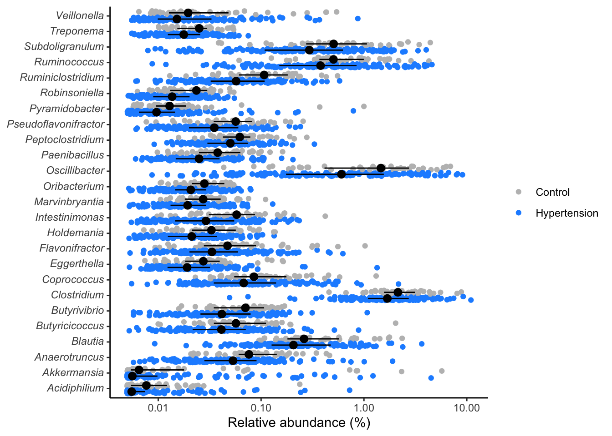
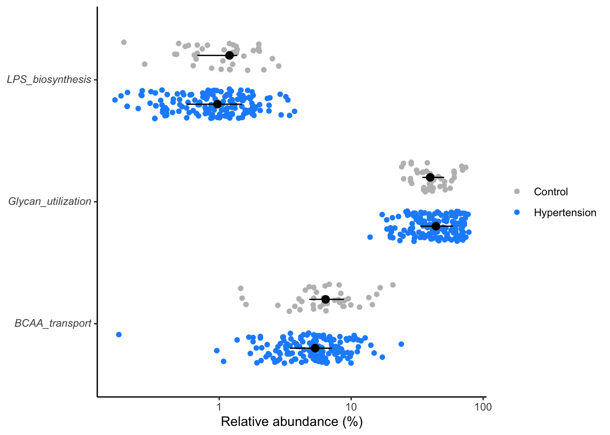
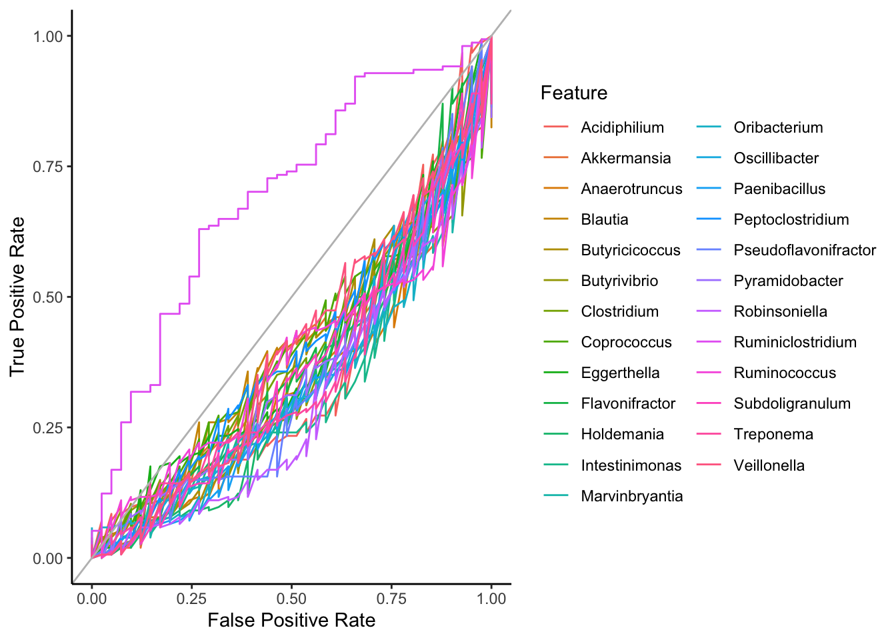
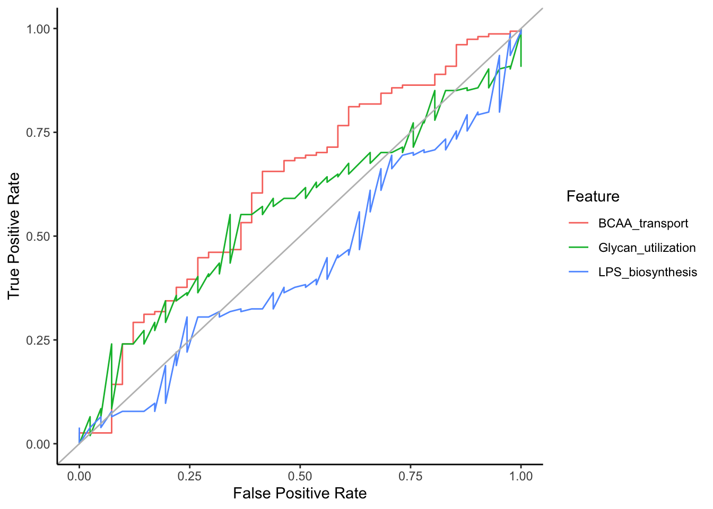

# (PART) CASE STUDY {-}

# Case Study: Applied Machine Learning for Microbiome Data Analysis

## Data Acquisition

The data for this practical guide was obtained from the NCBI (National Center for Biotechnology Information) project with the accession number [PRJEB13870](https://www.ncbi.nlm.nih.gov/bioproject/PRJEB13870). The project titled "Gut microbiota dysbiosis contributes to the development of hypertension" serves as an ideal resource to demonstrate the process of building a predictive analysis model. This dataset offers valuable insights into the association between gut microbiota composition and hypertension development, a critical area of research within the fields of microbiology and cardiovascular health.

## Study description

This study employed a multifaceted approach, integrating metagenomics and metabonomics analyses alongside fecal microbiota transplantation (FMT). By investigating the dysbiosis of the gut microbiome, the study elucidated its role as a contributing factor to the pathogenesis of hypertension, primarily through alterations in metabolic effects. Through these methodologies, the research aimed to provide a comprehensive understanding of the intricate relationship between gut microbiota composition and the development of hypertension.


## Data integration
This section outlines the steps involved in processing the OTU table, taxonomy data, metabolites, and metadata, aligning with the multifaceted approach employed in the study description.


```r
# Load necessary libraries with suppressed startup messages
library(tidyverse, suppressPackageStartupMessages())
library(broom)
library(ggtext)
library(data.table)

# Set seed for reproducibility
set.seed(2022)

# Read and process the OTU table data
otutable <- read_csv("data/HypertensionProject.csv", show_col_types = FALSE) %>%
  dplyr::select(1, Prevotella:ncol(.)) %>%
  data.table::transpose(keep.names = "taxonomy", make.names = "SampleID") %>%
  pivot_longer(-taxonomy, names_to="sample_id", values_to="rel_abund") %>%
  relocate(sample_id)

# Read and process the metabolites data
metabolites <- read_csv("data/HypertensionProjectMetabolites.csv", show_col_types = FALSE) %>%
  dplyr::select(c(1,5:18)) %>%
  data.table::transpose(keep.names = "metabopwy", make.names = "SampleID") %>%
  pivot_longer(-metabopwy, names_to="sample_id", values_to="value") %>%
  group_by(sample_id) %>% 
  mutate(rel_abund = value/sum(value)) %>% 
  ungroup() %>% 
  dplyr::select(-value) %>% 
  relocate(sample_id)

# Read and process the taxonomy data
taxonomy <- read_tsv("data/mo_demodata/baxter.cons.taxonomy", show_col_types = FALSE) %>%
  rename_all(tolower) %>%
  dplyr::select(otu, taxonomy) %>%
  mutate(taxonomy = str_replace_all(taxonomy, "\\(\\d+\\)", ""),
         taxonomy = str_replace(taxonomy, ";unclassified", "_unclassified"),
         taxonomy = str_replace_all(taxonomy, ";unclassified", ""),
         taxonomy = str_replace_all(taxonomy, ";$", ""),
         taxonomy = str_replace_all(taxonomy, ".*;", ""))

# Read and process the metadata
metadata <- read_csv("data/HypertensionProject.csv", show_col_types = FALSE) %>%
  dplyr::select(c(1:3)) %>%
  mutate(hyper = Disease_State == "HTN" | Disease_State == "pHTN",
         control = Disease_State == "healthy") %>%
  rename(sample_id = SampleID)

## Data joining

# Join metadata with OTU table to create composite dataset
composite <- inner_join(metadata, otutable, by="sample_id")

# Join metadata with metabolites data to create composite metabolites dataset
metabo_composite <- inner_join(metadata, metabolites, by="sample_id")
```


# Data for Machine Learning Analysis

This section outlines the preprocessing steps involved in preparing data subsets tailored for machine learning analysis. The code segments transform raw data into structured formats suitable for predictive modeling. Specifically, the subsets created encompass various combinations of taxonomic or metabolic features alongside binary labels representing selected features. Each subset undergoes specific preprocessing steps, including data selection, transformation, and encoding, to ensure compatibility with machine learning algorithms.


```r
# Subset for machine learning analysis: Taxonomic genus features with disease states

ml_genus_dsestate <- composite %>%
  select(sample_id, taxonomy, enttype = Enterotype, rel_abund, dsestate = Disease_State) %>%
  pivot_wider(names_from=taxonomy, values_from = rel_abund) %>%
  select(-sample_id) %>%
  mutate(enttype = if_else(enttype == "Enterotype_1", "0", "1")) %>%
  mutate(dsestate = if_else(dsestate == "pHTN" | dsestate == "HTN" , "0", "1")) %>%
  select(-enttype) %>%
  select(dsestate, everything())

# Subset for machine learning analysis: Taxonomic genus features with enterotypes
ml_genus_enttype <- composite %>%
  select(sample_id, taxonomy, enttype = Enterotype, rel_abund, dsestate = Disease_State) %>%
  pivot_wider(names_from=taxonomy, values_from = rel_abund) %>%
  select(-sample_id) %>%
  mutate(enttype = if_else(enttype == "Enterotype_1", "0", "1")) %>%
  mutate(dsestate = if_else(dsestate == "pHTN" | dsestate == "HTN" , "0", "1")) %>%
  select(-dsestate) %>%
  select(enttype, everything())

# Using dietswap dataset from microbiome package

load("../imap-data-preparation/data/phyloseq_raw_rel_psextra_df_objects.rda")
library(dplyr)
library(tidyr)


# Nationality feature
ml_genus_nationality <- ps_df %>%
  select(sample_id, taxon, nationality, rel_abund, bmi) %>%
  mutate(
    taxon = str_replace_all(taxon, "\\*", ""),
    nationality = factor(if_else(nationality == "AAM", "0", "1"), levels = c("0", "1")),
    bmi = factor(if_else(bmi == "overweight" | bmi == "obese", "0", "1"), levels = c("0", "1"))
  ) %>%
  group_by(sample_id, taxon, nationality, bmi) %>%
  summarise(rel_abund = mean(rel_abund), .groups = "drop") %>%
  pivot_wider(names_from = taxon, values_from = rel_abund) %>%
  ungroup() %>%
  filter(!is.na(nationality)) %>%  # Remove rows with NA in the 'nationality' column
  select(-c(sample_id, bmi)) %>%
  mutate(across(starts_with("rel_abund"), as.numeric))

# Body mass index feature
ml_genus_bmi <- ps_df %>%
  select(sample_id, taxon, nationality, rel_abund, bmi) %>%
  mutate(
    taxon = str_replace_all(taxon, "\\*", ""),
    nationality = factor(if_else(nationality == "AAM", "0", "1"), levels = c("0", "1")),
    bmi = factor(if_else(bmi == "overweight" | bmi == "obese", "0", "1"), levels = c("0", "1"))
  ) %>%
  group_by(sample_id, taxon, nationality, bmi) %>%
  summarise(rel_abund = mean(rel_abund), .groups = "drop") %>%
  pivot_wider(names_from = taxon, values_from = rel_abund) %>%
  ungroup() %>%
  filter(!is.na(bmi)) %>%  # Remove rows with NA in the 'bmi' column
  select(-c(sample_id, nationality)) %>%
  mutate(across(starts_with("rel_abund"), as.numeric))

# Save the processed data objects into an RDA file
save(otutable, 
     metabolites, 
     taxonomy, 
     metadata, 
     composite, 
     metabo_composite, 
     ml_genus_nationality, 
     ml_genus_enttype, 
     ml_genus_nationality, 
     ml_genus_bmi, 
     file = "data/ml_n_composite_object.rda")
```


<div class="alerticon">
<p><strong>Note for users:</strong></p>
<blockquote>
<p>If you encounter issues where pivot_wider() returns values as
&lt;list&gt;, it may be due to multiple values for the same combination
of identifiers (e.g., sample ID and feature). In such cases, consider
aggregating the values using group_by() and summarise() before
pivoting.</p>
</blockquote>
<p>Example:</p>
<p>ps_df %&gt;% select(sample_id, taxon, nationality, rel_abund, bmi)
%&gt;% mutate(taxon = str_replace_all(taxon, “\*“,”“)) %&gt;%
group_by(sample_id, taxon, nationality, bmi) %&gt;% summarise(rel_abund
= mean(rel_abund), .groups =”drop”) %&gt;% pivot_wider(names_from =
taxon, values_from = rel_abund) %&gt;% mutate(nationality =
if_else(nationality == “AAM”, “0”, “1”)) %&gt;% mutate(bmi = if_else(bmi
== “overweight” | bmi == “obese” , “0”, “1”)) %&gt;%
select(-c(sample_id, bmi))</p>
<blockquote>
<p>This ensures that the rel_abund values are properly aggregated before
pivoting.</p>
</blockquote>
</div>


# (PART) PERFORMANCE METRICS {-}

# Specificity and Sensitivity function


```r
library(purrr)

get_sens_spec <- function(threshold, score, actual, direction){
  
  predicted <- if(direction == "greaterthan") {
    score > threshold 
    } else {
      score < threshold
    }
  
  tp <- sum(predicted & actual)
  tn <- sum(!predicted & !actual)
  fp <- sum(predicted & !actual)
  fn <- sum(!predicted & actual)  
  
  specificity <- tn / (tn + fp)
  sensitivity <- tp / (tp + fn)
  
  tibble("specificity" = specificity, "sensitivity" = sensitivity)
}

get_roc_data <- function(x, direction){
  
  # x <- test
  # direction <- "greaterthan"
  
  thresholds <- unique(x$score) %>% sort()
  
  map_dfr(.x=thresholds, ~get_sens_spec(.x, x$score, x$srn, direction)) %>%
    rbind(c(specificity = 0, sensitivity = 1))
}
```


## Significant genera with `wilcox.test`


```r
library(purrr)
library(dplyr)
library(tidyr)

all_genera <- composite %>%
  tidyr::nest(data = -taxonomy) %>%
  mutate(test = purrr::map(.x=data, ~wilcox.test(rel_abund~hyper, data=.x) %>% tidy)) %>%
  tidyr::unnest(test) %>%
  mutate(p.adjust = p.adjust(p.value, method="BH"))

sig_genera <- all_genera %>% 
  dplyr::filter(p.value < 0.05) %>%
  arrange(p.adjust) %>% 
  dplyr::select(taxonomy, p.value)
```

## View distribution of significant genera

```r
composite %>%
  inner_join(sig_genera, by="taxonomy") %>%
  mutate(rel_abund = 100 * (rel_abund + 1/20000),
         taxonomy = str_replace(taxonomy, "(.*)", "*\\1*"),
         taxonomy = str_replace(taxonomy, "\\*(.*)_unclassified\\*",
                                "Unclassified<br>*\\1*"),
         hyper = factor(hyper, levels = c(T, F))) %>%
  ggplot(aes(x=rel_abund, y=taxonomy, color=hyper, fill=hyper)) +
  # geom_vline(xintercept = 100/10530, size=0.5, color="gray") +
  geom_jitter(position = position_jitterdodge(dodge.width = 0.8,
                                              jitter.width = 0.5),
              shape=21) +
  stat_summary(fun.data = median_hilow, fun.args = list(conf.int=0.5),
               geom="pointrange",
               position = position_dodge(width=0.8),
               color="black", show.legend = FALSE) +
  scale_x_log10() +
  scale_color_manual(NULL,
                     breaks = c(F, T),
                     values = c("gray", "dodgerblue"),
                     labels = c("Control", "Hypertension")) +
  scale_fill_manual(NULL,
                     breaks = c(F, T),
                     values = c("gray", "dodgerblue"),
                     labels = c("Control", "Hypertension")) +
  labs(x= "Relative abundance (%)", y=NULL) +
  theme_classic() +
  theme(
    axis.text.y = element_markdown()
  )
```



```r
ggsave("figures/significant_genera.tiff", width=6, height=4)
```

## Significant pathways
Compute the significant pathways using `wilcox.test`.


```r
library(tidyverse)

all_metabopwy <- metabo_composite %>%
  tidyr::nest(data = -metabopwy) %>%
  mutate(test = purrr::map(.x=data, ~wilcox.test(rel_abund~hyper, data=.x) %>% tidy)) %>%
  tidyr::unnest(test) %>%
  mutate(p.adjust = p.adjust(p.value, method="BH"))

sig_metabopwy <- all_metabopwy %>% 
  dplyr::filter(p.value < 0.3) %>% # Typically, the best significant p-value is set at 0.05
  dplyr::select(metabopwy, p.value)
```

## View distribution of significant metabolic pathways
- Compute the significant pathways, then
- P-values or Adjusted P-values (p.adjust) can be used to measure the significance levels.
- View the distribution of the significant pathways.


```r
metabo_composite %>%
  inner_join(sig_metabopwy, by="metabopwy") %>%
  mutate(rel_abund = 100 * (rel_abund + 1/20000),
         metabopwy = str_replace(metabopwy, "(.*)", "*\\1*"),
         metabopwy = str_replace(metabopwy, "\\*(.*)_unclassified\\*",
                                "Unclassified<br>*\\1*"),
         hyper = factor(hyper, levels = c(T, F))) %>%
  ggplot(aes(x=rel_abund, y=metabopwy, color=hyper, fill=hyper)) +
  geom_jitter(position = position_jitterdodge(dodge.width = 0.8,
                                              jitter.width = 0.5),
              shape=21) +
  stat_summary(fun.data = median_hilow, fun.args = list(conf.int=0.5),
               geom="pointrange",
               position = position_dodge(width=0.8),
               color="black", show.legend = FALSE) +
  scale_x_log10() +
  scale_color_manual(NULL,
                     breaks = c(F, T),
                     values = c("gray", "dodgerblue"),
                     labels = c("Control", "Hypertension")) +
  scale_fill_manual(NULL,
                     breaks = c(F, T),
                     values = c("gray", "dodgerblue"),
                     labels = c("Control", "Hypertension")) +
  labs(x= "Relative abundance (%)", y=NULL) +
  theme_classic() +
  theme(
    axis.text.y = element_markdown()
  )
```



```r
ggsave("figures/significant_genera.tiff", width=6, height=4)
```

> Here we filter the metabolic pathways at a lesser stringent `p.values` (p < 0.25) for demo purposes.


## ROC curve: Receiver Operating Characteristic curve
- Shows the performance of a classification model at all classification thresholds. 
- Plots **True Positive Rate (TPR = Sensitivity)** and **False Positive Rate (FPR = 1 - Specificity)** at all classification thresholds.

## AUC: Area Under the ROC Curve
- It measures the entire two-dimensional area underneath the entire ROC curve.
- In calculus it can be represented as (0,0) to (1,1).
- AUC provides an aggregate measure of performance across all possible classification thresholds. 

AUC is desirable for the following two reasons:

- AUC is **scale-invariant**. It measures how well predictions are ranked, rather than their absolute values.
- AUC is **classification-threshold-invariant**. It measures the quality of the model's predictions irrespective of what classification threshold is chosen

![]

## Load functions and data objects
Functions for computing:
 
- Sensitivity
- Specificity
- ROC

Data objects for the ROC curve
- composite
- metabo_composite


```r
get_sens_spec <- function(threshold, score, actual, direction){

  predicted <- if(direction == "greaterthan") {
    score > threshold
  } else {
    score < threshold
  }

  tp <- sum(predicted & actual)
  tn <- sum(!predicted & !actual)
  fp <- sum(predicted & !actual)
  fn <- sum(!predicted & actual)

  specificity <- tn / (tn + fp)
  sensitivity <- tp / (tp + fn)

  tibble("specificity" = specificity, "sensitivity" = sensitivity)
}

get_roc_data <- function(x, direction){
  thresholds <- unique(x$score) %>% sort()

  map_dfr(.x=thresholds, ~get_sens_spec(.x, x$score, x$hyper, direction)) %>%
    rbind(c(specificity = 0, sensitivity = 1))

}
load("data/composite_object.rda", verbose = T)
```

```
## Loading objects:
##   otutable
##   metabolites
##   taxonomy
##   metadata
##   composite
##   metabo_composite
```

## Prepare ROC data

<!-- - Use map2(.x, .y, .f, ...) from purrr package -->


```r
library(purrr)
library(dplyr)
library(tidyr) # for nest() & unnest()

roc_data <- composite %>%
  rename_all(tolower) %>% 
  inner_join(sig_genera, by="taxonomy") %>%
  dplyr::select(sample_id, taxonomy, rel_abund, hyper) %>%
  pivot_wider(names_from=taxonomy, values_from=rel_abund) %>%
  pivot_longer(cols=-c(sample_id, hyper), names_to="feature", values_to="score") %>%
  nest(data = -feature) %>%
  mutate(direction = if_else(feature == "Ruminiclostridium", "lessthan","greaterthan")) %>%
  mutate(roc_data = map2(.x = data, .y=direction, ~ get_roc_data(.x, .y))) %>%
  unnest(roc_data) %>%
  dplyr::select(feature, specificity, sensitivity)

## Plot ROC data
roc_data %>%
  ggplot(aes(x=1-specificity, y=sensitivity, color = feature)) +
  geom_line() +
  geom_abline(slope = 1, intercept = 0, color="gray") +
  theme_classic() + 
  labs(x = "False Positive Rate", y = "True Positive Rate", color = "Feature")
```



```r
ggsave("figures/roc_figure.tiff", width=6, height=4)
```

> Note: We have separate lines for each biomarker for the feature shown on the legend!

## Metabolic pathway data

```r
library(dplyr)
library(tidyr) # for nest() & unnest()

metabo_roc_data <- metabo_composite %>%
  rename_all(tolower) %>% 
  inner_join(sig_metabopwy, by="metabopwy") %>%
  dplyr::select(sample_id, metabopwy, rel_abund, hyper) %>%
  pivot_wider(names_from=metabopwy, values_from=rel_abund) %>%
  pivot_longer(cols=-c(sample_id, hyper), names_to="feature", values_to="score") %>%
  nest(data = -feature) %>%
  mutate(direction = if_else(feature == "BCAA_transport", "lessthan","greaterthan")) %>%
  mutate(roc_data = map2(.x = data, .y=direction, ~ get_roc_data(.x, .y))) %>%
  unnest(roc_data) %>%
  dplyr::select(feature, specificity, sensitivity)


metabo_roc_data %>%
  ggplot(aes(x=1-specificity, y=sensitivity, color = feature)) +
  geom_line() +
  geom_abline(slope = 1, intercept = 0, color="gray") +
  theme_classic() + 
  labs(x = "False Positive Rate", y = "True Positive Rate", color = "Feature")
```



```r
ggsave("figures/roc_figure.tiff", width=6, height=4)
```

> Note: We have separate lines for each biomarker for the feature shown on the legend!
> More data can be added to get a better improved classification.


# (PART) USE CASES IDEAS {-}

# Case Study: Predictive Model Performance Affected by Information Leakage

In this case study, we explore the performance of a predictive model developed to assess the likelihood of cancer in patients based on various medical records. The model incorporated patient demographics, medical history, vital signs, and diagnostic test results. When tested on a held-out dataset, it demonstrated exceptional accuracy during evaluation.

However, upon deployment to predict cancer likelihood for new patients, the model exhibited significant discrepancies in performance. This discrepancy led to an investigation to uncover potential causes for the observed inconsistency.

**Identifying the Issue:**

Upon closer examination, it became evident that the model's poor performance on new patients was attributed to information leakage. Specifically, one feature in the model inadvertently exposed sensitive information, which influenced the predictions. This form of information leakage compromised the model's ability to generalize to unseen data effectively.

**Implications:**

Information leakage poses serious implications for the predictive model's reliability and fairness. By inadvertently incorporating sensitive information, such as patient-specific details or external factors related to the prediction task, the model's performance on new data can be compromised. This can lead to inaccurate predictions and potentially harmful outcomes if relied upon in clinical decision-making.

**Recommendations:**

Conducting thorough feature selection and validation processes is imperative to address information leakage and ensure the model's robustness and generalizability. This involves identifying and removing features that may inadvertently expose sensitive information or introduce bias into the model. Additionally, implementing rigorous data preprocessing techniques and adhering to best practices in model development can help mitigate the risk of information leakage and enhance the reliability of predictive models.

By prioritizing transparency, fairness, and ethical considerations throughout the model development process, we can mitigate the risks associated with information leakage and build accurate and trustworthy predictive models.


## Some Effective [ML Guidelines](https://developers.google.com/machine-learning/crash-course/real-world-guidelines)
- Keep the first model simple.
- Focus on ensuring data pipeline correctness.
- Use a simple, observable metric for training & evaluation.
- Own and monitor your input features
- Treat your model configuration as code: review it, check it in
- Write down the results of all experiments, especially "failures"

```

