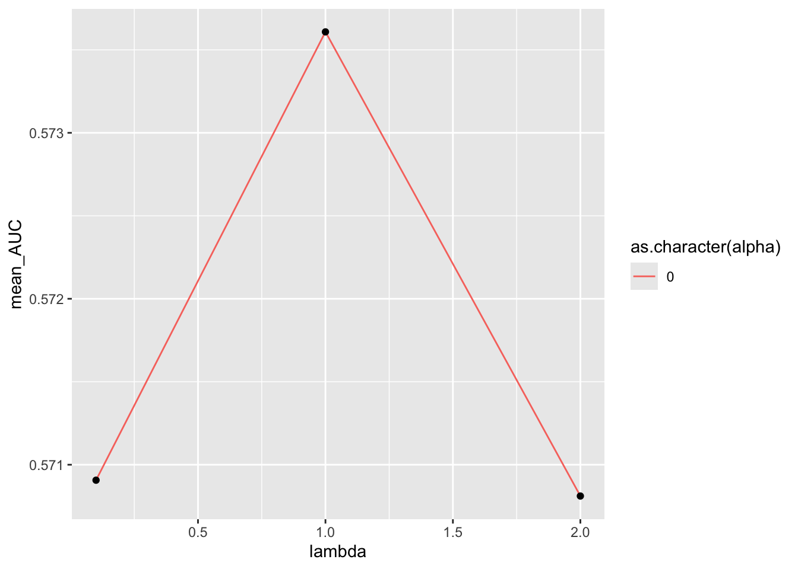

# (PART) LOGISTIC REGRESSION IN R {-}

# Microbiome Logistic Regression

In this section, we will delve into the application of logistic regression models for analyzing microbiome data. Logistic regression is a powerful statistical method used for binary classification tasks, making it particularly useful for predicting categorical outcomes based on microbiome profiles.


```r
knitr::opts_chunk$set(
  echo  =TRUE,
  message  =FALSE,
  warning  =FALSE,
  cache  =FALSE,
  fig.path = "figures",
  comment  =NA)
```

## Importing Data and Libraries


```r
source("R/genus_pwy_process.R")
library(tidyverse)
library(parallelly)
library(future)
library(mikropml)
library(caret)
library(tictoc)
library(furrr)
library(cgwtools)
```


> Before we begin, let's import necessary data and libraries required for our analysis.

## Checking Available Cores
It's essential to check the available processing cores, as it may influence the computational load that can be handled efficiently.


```r
availableCores()
```

```
system 
     8 
```


# Common Packages for Machine Learning in R

## Mikropml
Mikropml is a versatile R package tailored specifically for microbiome data analysis and machine learning tasks. It offers a comprehensive suite of tools for preprocessing microbiome data, constructing predictive models, and assessing their performance. By integrating popular machine learning methods like glmnet and caret, Mikropml provides a seamless workflow for analyzing microbiome datasets and building predictive models customized to address specific research inquiries. In this guide, we will utilize Mikropml, which integrates glmnet and caret, enhancing the efficiency and effectiveness of our machine learning analyses.

## Glmnet
Glmnet stands as a cornerstone package in R's machine learning landscape, primarily utilized for fitting generalized linear models through penalized maximum likelihood. Offering efficient algorithms for implementing regularized regression models, including ridge and lasso regression, Glmnet is invaluable for analyzing high-dimensional data. Its functionalities extend to prediction, model visualization, and cross-validation, rendering it a vital asset in constructing robust and interpretable models.

## Caret
Caret, short for Classification And REgression Training, emerges as a comprehensive package within R's machine learning arsenal. Encompassing a broad spectrum of algorithms and techniques spanning classification, regression, and feature selection, Caret provides a unified framework for model training and evaluation. Its user-friendly interface facilitates the comparison of different algorithms and enables efficient parameter tuning. With capabilities ranging from data preprocessing to model visualization, Caret serves as an indispensable tool for practitioners navigating the complexities of machine learning in R.


## Preprocessing and transformation

```r
library( mikropml)

source("R/genus_pwy_process.R")
hyper_genus_data <- composite %>%
  select(sample_id, taxonomy, rel_abund, hyper) %>%
  pivot_wider(names_from=taxonomy, values_from = rel_abund) %>%
  select(-sample_id) %>%
  mutate(hyper = if_else(hyper, "hyper", "healthy")) %>%
  select(hyper, everything())

hyper_genus_preprocess <- preprocess_data(hyper_genus_data,
                                        outcome_colname = "hyper")$dat_transformed
```

## Tuning parameters with multiple alpha

```r
test_hp <- list(alpha = c(0, 0.5, 1), 
                # lambda = c(0.1, 1, 2, 3, 4, 5, 10))
                lambda = c(0.1, 1, 2))
```

## Function for model training
Useful terminologies

- Cross-validation
 - Used in machine learning for improving model prediction
 - Useful when we don't have enough for more efficient methods like the 3-way split (train, validation and test) or a holdout dataset.
- **K-Fold** 
  - Is a validation technique
  - Data is split into k-subsets
  - Holdout method is repeated k-times where each of the k subsets are used as test set and other k-1 subsets are used for the training purpose.
  

```r
get_hp_results <- function(seed){
  
  run_ml(hyper_genus_preprocess,
       method="glmnet",
       outcome_colname = "hyper",
       kfold = 5,
       cv_times = 100,
       training_frac = 0.8, # training set: 80% 
       hyperparameters = test_hp, 
       seed = seed)
}
```

# Parallelization training 
> Models such as L2 Regularized Logistic Regression run very fast compared to others such as Random Forest Regression. Parallelization can help in speeding model training.

- The `future-map()` function from `furrr` package help to speed up the training.
- It applies a function to each element of a vector via futures.
- The `future_map()` returns a list.

> Important: Add the future specific `options` to use with the workers. This must be the result from a call to furrr_options(), eg. options = furrr_options(seed=TRUE)

## Parallel iterative model training


## Combine performance results

```r
performance <- readRDS("data/model_training_results.rds") %>%
  map(pluck, "trained_model") %>%
  combine_hp_performance()

  saveRDS(performance, "data/performance.rds")
  
  resave(performance, file = "data/model_training_results.rda")
```

# Exploring model performance
Combined results contains:

1. Data (dat): 3-column dataframe including:
  - Alpha ($\alpha$: Is the parameter that determines the weighting to be used. In ridge regression = 0, in Lasso = 1, in elastic regression is between 0 and 1.
  - Lambda ($\lambda$): Is a Regularization Parameter, a constant that fine-tune the amount of the penalty. Good value for $\lambda$ is critical.
  - AUC: An aggregated metric that evaluates how well a logistic regression model classifies positive and negative outcomes at all possible cutoffs. 
2. Params (params): Lambda
3. Metric (metric): AUC

### Performance  results

```r
 readRDS("data/performance.rds")$dat %>% 
  tail()
```

```
   alpha lambda       AUC
40   0.5    0.1 0.5640272
41   0.5    1.0 0.5000000
42   0.5    2.0 0.5000000
43   1.0    0.1 0.5190963
44   1.0    1.0 0.5000000
45   1.0    2.0 0.5000000
```


### Performance plot

```r
plot_hp_performance(readRDS("data/performance.rds")$dat, lambda, AUC)
```


Interpretation

- The dot represents the metric mean (mean_AUC).
- The bar represents the + and - a standard deviation.

## Top three AUC values

```r
readRDS("data/performance.rds")$dat %>%
  group_by(alpha, lambda) %>%
  summarise(mean_AUC = mean(AUC), 
            lquartile = quantile(AUC, prob=0.25),
            uquartile = quantile(AUC, prob=0.75),
            .groups="drop") %>%
  top_n(n=3, mean_AUC)  %>% 
  ggplot(aes(x = lambda, y = mean_AUC, color = as.character(alpha))) +
  geom_line() +
  geom_point(color = "black")
```




## Using helper function
> How do you know what are the different hyperparameter options are and what are the dafault values for the different modeling approaches


```r
get_hyperparams_list(hyper_genus_preprocess, "glmnet")
```

```
$lambda
[1] 1e-04 1e-03 1e-02 1e-01 1e+00 1e+01

$alpha
[1] 0
```

```r
get_hyperparams_list(hyper_genus_preprocess, "rf")
```

```
$mtry
[1]  4  7 14
```

```r
get_hyperparams_list(hyper_genus_preprocess, "svmRadial")
```

```
$C
[1] 1e-03 1e-02 1e-01 1e+00 1e+01 1e+02

$sigma
[1] 1e-06 1e-05 1e-04 1e-03 1e-02 1e-01
```

```r
get_hyperparams_list(hyper_genus_preprocess, "rpart2") # Decision tree
```

```
$maxdepth
[1]  1  2  4  8 16 30
```

```r
get_hyperparams_list(hyper_genus_preprocess, "xgbTree") # Xboost
```

```
$nrounds
[1] 100

$gamma
[1] 0

$eta
[1] 0.001 0.010 0.100 1.000

$max_depth
[1]  1  2  4  8 16 30

$colsample_bytree
[1] 0.8

$min_child_weight
[1] 1

$subsample
[1] 0.4 0.5 0.6 0.7
```

