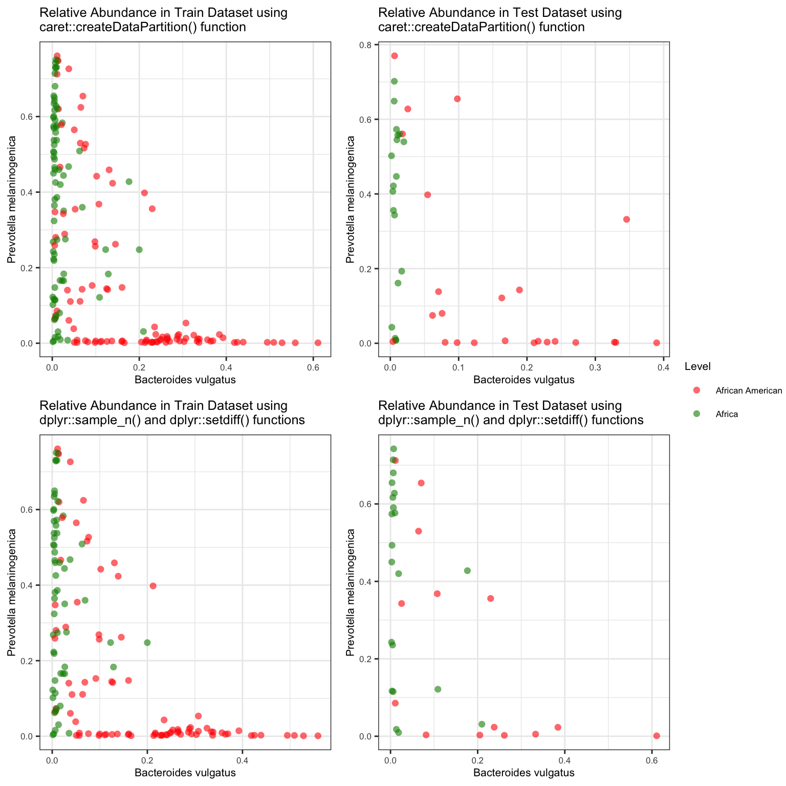

# (PART) MODEL TRAINING {-}

# Data Splitting
The dataset is divided into separate subsets for training and testing. This partitioning allows for an unbiased evaluation of the model's performance on unseen data, helping to assess its ability to generalize to new observations.


## Load necessary libraries

```r
set.seed(1234)


# Load necessary libraries
library(caret)
library(tidyverse)

# Example dataset (replace with your own data)

load("data/data_imputed.rda")
data <- data_imputed #%>%
  # mutate(target_text = dplyr::recode_factor(target, "0" = "AAM", "1" = "AFR"), .after = 1)
```

## Split using caret::createDataPartition()


```r
# Split data into training and testing sets
set.seed(123) # for reproducibility
train_index <- caret::createDataPartition(data$target, p = 0.8, list = FALSE)
train_data <- data[train_index, ]
test_data <- data[-train_index, ]

write_csv(test_data, "models/test_data.csv")

save(train_data, test_data, file = "data/train_test_data.rda")
```

## Review train and test datasets


```r
cat("\nDimension of the train data using caret package\n is", base::dim(train_data)[1], "rows and", base::dim(train_data)[2], "columns.\n")

Dimension of the train data using caret package
 is 179 rows and 144 columns.
cat("\nDimension of the test data using caret package\n is", base::dim(test_data)[1], "rows and", base::dim(test_data)[2], "columns.\n")

Dimension of the test data using caret package
 is 43 rows and 144 columns.

cat("\nThe intersection between test and train dataset is", nrow(test_data %>% intersect(train_data)))

The intersection between test and train dataset is 0
```

## Spliting using dplyr::sample_n() and dplyr::setdiff() functions**


```r
set.seed(123)

library(dplyr)
test_df = train_data %>% dplyr::sample_n(0.2*nrow(train_data))
train_df = train_data %>% dplyr::setdiff(test_df)

cat("\nDimension of the test data using dplyr package\n is", base::dim(test_df)[1], "rows and", base::dim(test_df)[2], "columns.\n")

Dimension of the test data using dplyr package
 is 35 rows and 144 columns.
cat("\nDimension of the train data using dplyr package\n is", base::dim(train_df)[1], "rows and", base::dim(train_df)[2], "columns.\n")

Dimension of the train data using dplyr package
 is 144 rows and 144 columns.

cat("\nThe intersection between test and train dataset is", nrow(test_df %>% intersect(train_df)))

The intersection between test and train dataset is 0
```

## Relative abundance in training and testing datasets


```r
library(dplyr)
library(ggplot2)
library(ggpubr)

cols <- c("0" = "red","1" = "green4")

p1 <- train_data %>% ggplot(aes(x = `Bacteroides vulgatus`, y = `Prevotella melaninogenica`, color = factor(target))) + geom_point(size = 2, shape = 16, alpha = 0.6) +
  labs(title = "Relative Abundance in Train Dataset using \ncaret::createDataPartition() function") +
  scale_colour_manual(values = cols, labels = c("African American", "Africa"), name="Level") +
  theme_bw() +
  theme(text = element_text(size = 8))

p2 <- test_data %>% ggplot(aes(x = `Bacteroides vulgatus`, y = `Prevotella melaninogenica`, color = factor(target))) + geom_point(size = 2, shape = 16, alpha = 0.6) +
  labs(title = "Relative Abundance in Test Dataset using \ncaret::createDataPartition() function") +
  scale_colour_manual(values = cols, labels = c("African American", "Africa"), name="Level") +
  theme_bw() +
  theme(text = element_text(size = 8))


p3 <- train_df %>% ggplot(aes(x = `Bacteroides vulgatus`, y = `Prevotella melaninogenica`, color = factor(target))) + geom_point(size = 2, shape = 16, alpha = 0.6) +
  labs(title = "Relative Abundance in Train Dataset using \ndplyr::sample_n() and dplyr::setdiff() functions") +
  scale_colour_manual(values = cols, labels = c("African American", "African"), name="Level") +
  theme_bw() +
  theme(text = element_text(size = 8))

p4 <- test_df %>% ggplot(aes(x = `Bacteroides vulgatus`, y = `Prevotella melaninogenica`, color = factor(target))) + geom_point(size = 2, shape = 16, alpha = 0.6) +
  labs(title = "Relative Abundance in Test Dataset using \ndplyr::sample_n() and dplyr::setdiff() functions") +
  scale_colour_manual(values = cols, labels = c("African American", "African"), name="Level") +
  theme_bw() +
  theme(text = element_text(size = 8))

# Arrange plots using ggpubr
ggarrange(p1, p2, p3, p4, nrow = 2, ncol = 2, common.legend = TRUE, legend = "right", heights = c(1, 1))
```




# Model Fitting

Microbiome data presents unique challenges and opportunities for modeling due to its high dimensionality and complexity. In this section, we explore various algorithms suitable for modeling microbiome datasets.


```r
if(!dir.exists("models")) {dir.create("models")}
```

## Regularized Logistic Regression Model
Regularized Logistic Regression (RLR) is a variant of logistic regression tailored for binary classification tasks commonly encountered in microbiome studies. It introduces penalty terms such as Lasso (L1) and Ridge (L2) to control model complexity and prevent overfitting.


```r
set.seed(1234)
library(ggplot2)

mod_regLogistic_cv <- train(target ~ ., data = train_data,
                            method = "regLogistic",
                            tuneLength = 12,
                            trControl = caret::trainControl(method = "adaptive_cv",
                                                             verboseIter = FALSE),
                            tuneGrid = base::expand.grid(cost = seq(0.001, 1, length.out = 20),
                                                         loss =  "L2_primal",
                                                         epsilon = 0.01 ))

print(head(capture.output(mod_regLogistic_cv), n = 15), quote = FALSE)
 [1] Regularized Logistic Regression                                    
 [2]                                                                    
 [3] 179 samples                                                        
 [4] 143 predictors                                                     
 [5]   2 classes: '0', '1'                                              
 [6]                                                                    
 [7] No pre-processing                                                  
 [8] Resampling: Adaptively Cross-Validated (10 fold, repeated 1 times) 
 [9] Summary of sample sizes: 161, 162, 161, 161, 161, 161, ...         
[10] Resampling results across tuning parameters:                       
[11]                                                                    
[12]   cost        Accuracy   Kappa      Resamples                      
[13]   0.00100000  0.5725490  0.0744186   5                             
[14]   0.05357895  0.6813725  0.3315495   6                             
[15]   0.10615789  0.7096950  0.4041659   6                             


# Plot Accuracy vs. cost for Regularized Logistic Regression Model (Adaptive CV)
ggplot(mod_regLogistic_cv$results, aes(x = cost, y = Accuracy)) +
  geom_line(color = "blue") +
  geom_point(color = "black") +
  labs(title = "Accuracy vs. Cost for \nRegularized Logistic Regression Model (Adaptive CV)",
       x = "Cost", y = "Accuracy") +
  theme_bw()
```


## Generalized Linear Models (glmnet)
glmnet is a package in R that fits Generalized Linear Models with Lasso or Elastic-Net regularization. It's particularly useful for microbiome data analysis due to its ability to handle high-dimensional datasets with sparse features.


```r
set.seed(1234)
mod_glmnet_adcv <- train(target ~ ., data = train_data,
             method = "glmnet",
             tuneLength = 12,
             trControl = caret::trainControl(method = "adaptive_cv"))

print(head(capture.output(mod_glmnet_adcv), n = 15), quote = FALSE)
 [1] glmnet                                                             
 [2]                                                                    
 [3] 179 samples                                                        
 [4] 143 predictors                                                     
 [5]   2 classes: '0', '1'                                              
 [6]                                                                    
 [7] No pre-processing                                                  
 [8] Resampling: Adaptively Cross-Validated (10 fold, repeated 1 times) 
 [9] Summary of sample sizes: 161, 162, 161, 161, 161, 161, ...         
[10] Resampling results across tuning parameters:                       
[11]                                                                    
[12]   alpha      lambda        Accuracy   Kappa       Resamples        
[13]   0.1000000  0.0001194437  0.9437908  0.88870667   5               
[14]   0.1000000  0.0002425803  0.9437908  0.88870667   5               
[15]   0.1000000  0.0004926607  0.9437908  0.88870667   5               

set.seed(1234)
## Visualize the model performance

library(ggplot2)

# Plot Accuracy vs. lambda for glmnet Model (Adaptive CV)
ggplot(mod_glmnet_adcv$results, aes(x = lambda, y = Accuracy)) +
  geom_line(color = "blue") +
  geom_point(color = "black") +
  labs(title = "Accuracy vs. Lambda for \nglmnet Model (Adaptive CV)",
       x = "Lambda", y = "Accuracy") +
  theme_bw()
```


## Random Forest
Random Forest is an ensemble learning technique that combines multiple decision trees to improve predictive performance. It's well-suited for handling the high-dimensional and nonlinear nature of microbiome data while mitigating overfitting.


```r
set.seed(1234)
mod_rf_reptcv <- train(target ~ ., data = train_data,
             method = "rf",
             tuneLength = 12,
             trControl = caret::trainControl(method = "repeatedcv"))

print(head(capture.output(mod_rf_reptcv), n = 15), quote = FALSE)
 [1] Random Forest                                              
 [2]                                                            
 [3] 179 samples                                                
 [4] 143 predictors                                             
 [5]   2 classes: '0', '1'                                      
 [6]                                                            
 [7] No pre-processing                                          
 [8] Resampling: Cross-Validated (10 fold, repeated 1 times)    
 [9] Summary of sample sizes: 161, 162, 161, 161, 161, 161, ... 
[10] Resampling results across tuning parameters:               
[11]                                                            
[12]   mtry  Accuracy   Kappa                                   
[13]     2   0.9663399  0.9322683                               
[14]    14   0.9549020  0.9085759                               
[15]    27   0.9493464  0.8980417                               

## Visualize the model performance

library(ggplot2)


# Plot Accuracy vs. mtry for Random Forest Model (Repeated CV)
ggplot(mod_rf_reptcv$results, aes(x = mtry, y = Accuracy)) +
  geom_line(color = "blue") +
  geom_point(color = "black") +
  labs(title = "Accuracy vs. mtry for Random Forest Model (Repeated CV)",
       x = "mtry", y = "Accuracy") +
  theme_bw()
```


**Random Forest model performance during training (using metrics like accuracy)**


```r
set.seed(1234)
## Visualize the model performance


mod_rf_adcv <- train(target ~ ., data = train_data,
             method = "rf",
             tuneLength = 12,
             trControl = caret::trainControl(method = "adaptive_cv",
                      verboseIter = FALSE))

print(head(capture.output(mod_rf_adcv), n = 15), quote = FALSE)
 [1] Random Forest                                                      
 [2]                                                                    
 [3] 179 samples                                                        
 [4] 143 predictors                                                     
 [5]   2 classes: '0', '1'                                              
 [6]                                                                    
 [7] No pre-processing                                                  
 [8] Resampling: Adaptively Cross-Validated (10 fold, repeated 1 times) 
 [9] Summary of sample sizes: 161, 162, 161, 161, 161, 161, ...         
[10] Resampling results across tuning parameters:                       
[11]                                                                    
[12]   mtry  Accuracy   Kappa      Resamples                            
[13]     2   0.9663399  0.9322683  10                                   
[14]    14   0.9542484  0.9072082   5                                   
[15]    27   0.9431373  0.8849859   5                                   

library(ggplot2)

# Plot Accuracy vs. mtry for Random Forest Model (Adaptive CV)
ggplot(mod_rf_adcv$results, aes(x = mtry, y = Accuracy)) +
  geom_line(color = "blue") +
  geom_point(color = "black") +
  labs(title = "Accuracy vs. mtry for Random Forest Model (Adaptive CV)",
       x = "mtry", y = "Accuracy") +
  theme_bw()
```


## k-Nearest Neighbors (kNN)
kNN is a simple yet effective algorithm for classification and regression tasks in microbiome studies. It works by assigning a class label to an unclassified sample based on the majority class of its k nearest neighbors in the feature space.


```r
set.seed(1234)
mod_knn_reptcv <- train(target ~ ., data = train_data,
                        method = "knn",
                        tuneLength = 12,
                        trControl = caret::trainControl(method = "repeatedcv",
                                                         repeats = 2))
print(head(capture.output(mod_knn_reptcv), n = 15), quote = FALSE)
 [1] k-Nearest Neighbors                                        
 [2]                                                            
 [3] 179 samples                                                
 [4] 143 predictors                                             
 [5]   2 classes: '0', '1'                                      
 [6]                                                            
 [7] No pre-processing                                          
 [8] Resampling: Cross-Validated (10 fold, repeated 2 times)    
 [9] Summary of sample sizes: 161, 162, 161, 161, 161, 161, ... 
[10] Resampling results across tuning parameters:               
[11]                                                            
[12]   k   Accuracy   Kappa                                     
[13]    5  0.8153595  0.6319367                                 
[14]    7  0.8125817  0.6284433                                 
[15]    9  0.8066993  0.6175578                                 

library(ggplot2)

# Plot Accuracy vs. k for KNN Model (Repeated CV)
ggplot(mod_knn_reptcv$results, aes(x = k, y = Accuracy)) +
  geom_line(color = "blue") +
  geom_point(color = "black") +
  labs(title = "Accuracy vs. k for KNN Model (Repeated CV)",
       x = "k", y = "Accuracy") +
  theme_bw()
```


**k-Nearest Neighbors model performance during training (using metrics like accuracy)**


```r
set.seed(1234)
## Visualize the model performance

library(ggplot2)

mod_knn_adcv <- train(target ~ ., data = train_data,
                      method = "knn",
                      tuneLength = 12,
                      trControl = caret::trainControl(method = "adaptive_cv",
                                                       repeats = 2,
                                                       verboseIter = FALSE))

print(head(capture.output(mod_knn_adcv), n = 15), quote = FALSE)
 [1] k-Nearest Neighbors                                                
 [2]                                                                    
 [3] 179 samples                                                        
 [4] 143 predictors                                                     
 [5]   2 classes: '0', '1'                                              
 [6]                                                                    
 [7] No pre-processing                                                  
 [8] Resampling: Adaptively Cross-Validated (10 fold, repeated 2 times) 
 [9] Summary of sample sizes: 161, 162, 161, 161, 161, 161, ...         
[10] Resampling results across tuning parameters:                       
[11]                                                                    
[12]   k   Accuracy   Kappa      Resamples                              
[13]    5  0.8153595  0.6319367  20                                     
[14]    7  0.7997199  0.6000193   7                                     
[15]    9  0.8028322  0.6086850   6                                     

# Plot Accuracy vs. k for KNN Model (Adaptive CV)
ggplot(mod_knn_adcv$results, aes(x = k, y = Accuracy)) +
  geom_line(color = "blue") +
  geom_point(color = "black") +
  labs(title = "Accuracy vs. k for KNN Model (Adaptive CV)",
       x = "k", y = "Accuracy") +
  theme_bw()
```


## Decision Trees
Decision Trees offer an intuitive approach to modeling microbiome data by recursively partitioning the feature space based on microbial abundance levels. While susceptible to overfitting, decision trees provide insights into the hierarchical structure of microbiome communities.

## Support Vector Machines (SVM)
SVM is a powerful algorithm for classifying microbiome samples based on their microbial composition. By finding the optimal hyperplane that separates different microbial communities, SVM can effectively discern complex patterns in microbiome data.

## Neural Networks
Neural Networks, including Deep Learning architectures, offer a flexible framework for modeling microbiome datasets. These models can capture intricate relationships between microbial taxa and host phenotypes, making them valuable for tasks such as disease classification and biomarker discovery.

## Gradient Boosting Machines (GBM)
GBM is an ensemble learning method that builds a sequence of decision trees to gradually improve predictive accuracy. It's adept at handling complex interactions between microbial taxa and host factors, making it suitable for microbiome classification tasks.

## AdaBoost
AdaBoost is a boosting algorithm that combines multiple weak learners to create a strong classifier. It's particularly useful for microbiome data classification due to its ability to focus on difficult-to-classify samples and improve overall model performance.

## Naive Bayes
Naive Bayes is a probabilistic classifier based on Bayes' theorem and the assumption of independence between features. While its simplicity makes it computationally efficient, Naive Bayes can still provide competitive performance for microbiome classification tasks.


<div class="infoicon">
<blockquote>
<p>In certain models that utilize lambda, such as Regularized Logistic
Regression models, we have the capability to set lambda using
expressions to define a sequence of numerical values. For instance,
employing the expression 10^seq(-3, 3, by = 0.5) results in the
generation of numbers through raising 10 to the power of each element
within the sequence ranging from -3 to 3, with an increment of 0.5. The
output presents a sequence of values, such as 10^-3, 10^-2.5, 10^-2,
10^-1.5, 10^-1, 10^-0.5, 10^0, 10^0.5, 10^1, 10^1.5, 10^2, 10^2.5, and
10^3.</p>
</blockquote>
</div>


```r
save(mod_glmnet_adcv, mod_regLogistic_cv, mod_rf_adcv, mod_rf_reptcv, mod_knn_adcv, mod_knn_reptcv, file = "models/models.rda")
```
