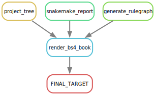

# (APPENDIX) APPENDIX {-}

# IMAP GitHub Repos

<div class="tmbinfo">
<table>
<colgroup>
<col width="32%" />
<col width="46%" />
<col width="20%" />
</colgroup>
<thead>
<tr class="header">
<th align="left">Repo</th>
<th>Description</th>
<th align="right">Status</th>
</tr>
</thead>
<tbody>
<tr class="odd">
<td align="left"><a
href="https://github.com/datainsights/imap-project-overview/">IMAP-OVERVIEW</a></td>
<td>IMAP project overview</td>
<td align="right"><a
href="https://datainsights.github.io/imap-project-overview/">In-progress</a></td>
</tr>
<tr class="even">
<td align="left"><a
href="https://github.com/tmbuza/imap-software-requirements/">IMAP-PART
01</a></td>
<td>Software requirement for microbiome data analysis with Snakemake
workflows</td>
<td align="right"><a
href="https://tmbuza.github.io/imap-software-requirements/">In-progress</a></td>
</tr>
<tr class="odd">
<td align="left"><a
href="https://github.com/tmbuza/imap-sample-metadata/">IMAP-PART
02</a></td>
<td>Downloading and exploring microbiome sample metadata from SRA
Database</td>
<td align="right"><a
href="https://tmbuza.github.io/imap-sample-metadata/">In-progress</a></td>
</tr>
<tr class="even">
<td align="left"><a
href="https://github.com/tmbuza/imap-download-sra-reads/">IMAP-PART
03</a></td>
<td>Downloading and filtering microbiome sequencing data from SRA
database</td>
<td align="right"><a
href="https://tmbuza.github.io/imap-download-sra-reads/">In-progress</a></td>
</tr>
<tr class="odd">
<td align="left"><a
href="https://github.com/tmbuza/imap-read-quality-control/">IMAP-PART
04</a></td>
<td>Quality Control of Microbiome Next Generation Sequencing Reads</td>
<td align="right"><a
href="https://tmbuza.github.io/imap-read-quality-control/">In-progress</a></td>
</tr>
<tr class="even">
<td align="left"><a
href="https://github.com/tmbuza/imap-bioinformatics-mothur/">IMAP-PART
05</a></td>
<td>Microbial profiling using MOTHUR and Snakemake workflows</td>
<td align="right"><a
href="https://tmbuza.github.io/imap-bioinformatics-mothur/">In-progress</a></td>
</tr>
<tr class="odd">
<td align="left"><a
href="https://github.com/tmbuza/imap-bioinformatics-qiime2/">IMAP-PART
06</a></td>
<td>Microbial profiling using QIIME2 and Snakemake workflows</td>
<td align="right"><a
href="https://tmbuza.github.io/imap-bioinformatics-qiime2/">In-progress</a></td>
</tr>
<tr class="even">
<td align="left"><a
href="https://github.com/tmbuza/imap-data-processing/">IMAP-PART
07</a></td>
<td>Processing Output from 16S-Based microbiome bioinformatics
pipelines</td>
<td align="right"><a
href="https://tmbuza.github.io/imap-data-processing/">In-progress</a></td>
</tr>
<tr class="odd">
<td align="left"><a
href="https://github.com/tmbuza/imap-exploratory-analysis/">IMAP-PART
08</a></td>
<td>Exploratory Analysis of 16S-Based Microbiome Processed Data</td>
<td align="right"><a
href="https://tmbuza.github.io/imap-exploratory-analysis/">In-progress</a></td>
</tr>
<tr class="even">
<td align="left"><a
href="https://github.com/tmbuza/imap-snakemake-workflows/">IMAP-SUMMARY</a></td>
<td>Summary of snakemake workflows for microbiome data analysis</td>
<td align="right"><a
href="https://tmbuza.github.io/imap-snakemake-workflows/">In-progress</a></td>
</tr>
</tbody>
</table>
</div>

# Read QC Rulegraph




# Session Information

Reproducibility relies on the ability to precisely recreate the working environment, and session information serves as a vital reference to achieve this consistency. Here we record details about the R environment, package versions, and system settings of the computing environment at the time of analysis. 


```r
library(knitr)
library(sessioninfo)

# Get session info
info <- capture.output(print(session_info()))

# Create the 'resources' folder if it doesn't exist
if (!dir.exists("resources")) {
  dir.create("resources")
}

# Save the session information to a text file without line numbers
cat(info, file = "session_info.txt", sep = "\n")
```

> For a detailed overview of the tools and versions suitable for this guide, I encourage you to explore the session information saved in the accompanying text file named `session_info.txt`,


```r
if(!require("reticulate")) {install.packages("reticulate")}
```

```
## Loading required package: reticulate
```

```r
library(reticulate)
```


```python
import sys
import platform

def get_python_session_info():
    info = {
        "Python Version": sys.version,
        "Python Compiler": platform.python_compiler(),
        "Python Implementation": platform.python_implementation(),
        "Platform": platform.platform(),
        "System": platform.system(),
        "Processor": platform.processor(),
    }
    return info

# Get Python session information
python_session_info = get_python_session_info()

# Save the information to a text file
output_file_path = 'python_session_info.txt'
with open(output_file_path, 'w') as file:
    for key, value in python_session_info.items():
        file.write(f"{key}: {value}\n")
```

```
## 98
## 31
## 31
## 39
## 15
## 15
```


```python
import pkg_resources

def get_installed_packages():
    installed_packages = []
    for package in pkg_resources.working_set:
        installed_packages.append((package.project_name, package.version))
    return installed_packages

# Get installed packages
installed_packages = get_installed_packages()

# Save the information to a text file
output_file_path = 'python_installed_packages.txt'
with open(output_file_path, 'w') as file:
    for package, version in installed_packages:
        file.write(f"{package}: {version}\n")
```

```
## 14
## 20
## 18
## 14
## 18
## 12
## 15
## 14
## 15
## 16
## 14
## 16
## 18
## 13
## 26
## 16
## 15
## 31
## 30
## 31
## 23
## 14
## 14
## 17
## 13
## 23
## 14
## 20
## 10
## 16
## 17
## 19
## 37
## 20
## 18
## 13
## 16
## 16
## 14
## 16
## 14
## 12
## 12
## 20
## 14
## 14
## 15
## 16
## 23
## 19
## 20
## 17
## 16
## 16
## 20
## 24
## 19
## 12
## 18
## 13
## 18
## 14
## 16
## 17
## 15
## 13
## 18
## 18
## 15
## 15
## 14
## 14
## 11
## 18
```


